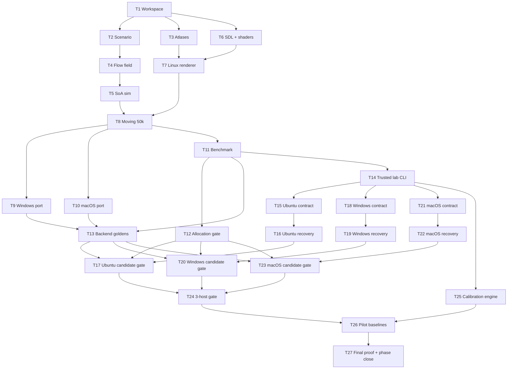

# Plan: Technical Prototype

## Goal

Build phase-0 Rust/SDL3 proof: 50k flow-field agents move + render at 1920×1080 on Linux/Vulkan, Windows/D3D12, macOS/Metal. Success: every ref host passes total-frame p95 ≤16.67 ms, p99 ≤25 ms; 100k recorded as nonblocking stretch.

## Scope

- In: Rust workspace; SDL3 GPU sprite renderer; fixed flow field; SoA sim; 50k/100k scenes; `run` + `bench`; local 3-host lab; perf/correctness/security gates; public contrib policy.
- Out: camera pan/zoom; selection; workers; economy; buildings; production; combat; AI; walls; waves; collision; separation; dynamic obstacles; per-agent pathfinding; prod art/audio; installers; signing; Steam; online CI; WebAssembly.

## Assumptions

- Current root package stays app package. No scaffold relocation/deletion.
- Rust pin starts at installed stable `1.95.0`; update only through reviewed maintenance.
- Current `sdl3`/`sdl3-sys`/SDL versions reverified in T6 before lock. Research candidates: `sdl3 0.18.4`, `sdl3-sys 0.6.7`, SDL `3.4.12`.
- Relative perf limits + image tolerance derive from physical pilot data. No invented values.
- `TODO(user)`: select MDM provider/account before T22. Apple Business Manager/ADE access required.
- 2026-08-05 amendment: hardware-gated tests deferred; see "Hardware deferral policy".

## Hardware deferral policy (2026-08-05, user-directed)

User instruction: ignore all tests requiring specific hardware. Effects:

- Any validation needing a physical Windows ref PC, M4 Mac, PXE/raw/WinPE/FFU/MDM lab infra, or real 3-host lane runs is tagged `[deferred-hw]` and does **not** block ticket completion.
- Hardware-only tickets **T9, T10, T16, T19, T22** → state `skipped (deferred-hw)`. Dependants treat these as satisfied for fixture/synthetic-scope work only.
- Dependent tickets (T13, T17, T20, T23, T24, T26, T27) proceed using fixture/synthetic equivalents; `[deferred-hw]` items stay unchecked in plan as an honest record.
- Relative baselines from synthetic data remain **disabled** pending owner review (existing T25 rule); no invented physical values are enabled.
- T27 phase close may only claim "Linux-verified; native cross-platform matrix deferred" — the full-confidence 3-OS claim stays unavailable until deferred items run on real hardware.

## Validated decision ledger

User approved each selected answer after rounds 1–6; final instruction: “I validate all remaining with recommended.” This ledger persists exact selections missing from questionnaire HTML.

### Round 1 — prototype foundation

| Q | Validated answer |
| --- | --- |
| R1.1 | Phase 0 only: technical scale prototype. |
| R1.2 | Developer-only engineering evaluation. |
| R1.3 | Linux + Windows + macOS full confidence; exact arch matrix set R2.2. |
| R1.4 | Repeatable perf thresholds with pass/fail gates. |

### Round 2 — proof contract

| Q | Validated answer |
| --- | --- |
| R2.1 | Source build, automated tests, native startup, GPU render, perf run on every OS. |
| R2.2 | Linux x86_64, Windows x86_64, macOS arm64. |
| R2.3 | Required real-GPU jobs on all OSes for every merge. |
| R2.4 | SDL3 GPU via safe `sdl3`; isolated `sdl3-sys` escape. |
| R2.5 | Shared flow field through fixed obstacles toward one destination. |
| R2.6 | End-to-end frame gate + sim/upload/GPU evidence. R6.3 corrects GPU metric to fence-latency proxy. |
| R2.7 | Defined entry-level ref machine per OS. |
| R2.8 | 50k hard gate; 100k measured stretch. |
| R2.9 | 60 Hz: p95 ≤16.67 ms; p99 ≤25 ms. |

### Round 3 — execution shape

| Q | Validated answer |
| --- | --- |
| R3.1 | Local scripts only; no hosted/online CI. |
| R3.2 | Public repo; anyone may contribute; owner alone accepts/merges/releases. |
| R3.3 | 3 dedicated physical self-hosted ref machines. |
| R3.4 | Hard perf gates on all 3 refs for every merge. |
| R3.5 | Ubuntu 24.04 LTS, Windows 11 25H2, macOS 15 arm64. |
| R3.6 | Matched 8600G + RX 6400 4 GB + 16 GB PCs; base M4 Mac mini 16 GB. |
| R3.7 | All 50k simulated + drawn at fixed 1920×1080. |
| R3.8 | Build flow field once before timing; fixed target/obstacles. |
| R3.9 | No agent collision/separation; overlap allowed. |
| R3.10 | Fixed 60 Hz sim independent from rendering. |
| R3.11 | Multiple atlases + directional animation. |
| R3.12 | Canonical HLSL → offline SPIR-V/DXIL/metallib. |
| R3.13 | Pin SDL3 source; build shared native libs per OS; cache/bundle for tests. |

### Round 4 — local validation

| Q | Validated answer |
| --- | --- |
| R4.1 | Public GitHub repo; Actions absent/disabled. |
| R4.2 | Sole maintainer/merger/releaser; contributors retain copyright. |
| R4.3 | `MIT-0`. |
| R4.4 | Rust coordinator CLI dispatches over SSH. |
| R4.5 | Contributor fast checks; owner reviews, runs full matrix, records pass, merges exact hash. |
| R4.6 | 10s warmup; 7×60s captures; median trial; MAD noise rejection. |
| R4.7 | Absolute gates + calibrated per-platform relative regression gates. |
| R4.8 | Frozen manifests; scheduled reviewed updates + recalibration. |
| R4.9 | Deterministic arrival recycle to seeded spawn cells; no allocation. |
| R4.10 | 4 atlases × 8 dirs × 4 frames; even distribution. |
| R4.11 | Premultiplied alpha; fixed atlas groups; no frame depth sort. |
| R4.12 | Checked-in versioned scenario + fixed seed + expected hash. |
| R4.13 | One app binary: `run`, `bench`, JSON report, optional overlay. |

### Round 5 — trusted execution

| Q | Validated answer |
| --- | --- |
| R5.1 | DCO 1.1 sign-off + inbound=outbound policy. |
| R5.2 | PR required; force/delete/auto-merge blocked; owner-only merge. |
| R5.3 | Dedicated no-secret hosts; network isolation; blocked candidate egress; unprivileged account; known-good reset before/after. |
| R5.4 | Content-addressed source archive over SSH; remote hash verify. |
| R5.5 | Track compact baselines/manifests; full JSON local; concise PR summary. |
| R5.6 | Offscreen 1080p perf gate + native visible swapchain smoke. |
| R5.7 | Total frame absolute+relative; component relative after calibration. |
| R5.8 | Exactly one fixed sim tick/measured render frame. |
| R5.9 | Frames-in-flight compact instances + 4 atlas draws. |
| R5.10 | 8-neighbor Dijkstra + diagonal costs + normalized descent vectors. |
| R5.11 | 480×270 cells ×4 px; 3×3 sprites; 20% obstacles. |
| R5.12 | Deterministic generated tracked PNG atlases + generator/hash tests. |
| R5.13 | Fixed camera; `Esc`, `F1`, `Space`; CLI scenario/count. |

### Round 6 — portability limits

| Q | Validated answer |
| --- | --- |
| R6.1 | Ubuntu PXE/raw; Windows WinPE/FFU; macOS EACS/ADE/MDM + DFU fallback. |
| R6.2 | Accept bounded firmware risk; attest; quarantine/reflash/replace drift. |
| R6.3 | Relative async submit-to-fence latency proxy; RenderDoc/Xcode true GPU diagnosis. |
| R6.4 | Cargo workspace: engine lib, app, trusted lab CLI, `xtask`. |
| R6.5 | Exact `rust-toolchain.toml`; Nix flake Linux; `rustup` Win/macOS. |
| R6.6 | `f32` SoA + quantized cross-platform checks/tolerance. |
| R6.7 | Track HLSL + generated SPIR-V/DXIL/metallib; hash/regen checks. |
| R6.8 | Per-backend goldens + bounded image tolerance + strict manifests. |
| R6.9 | Counting allocator; fail post-warmup sim/render-loop Rust allocations. |
| R6.10 | 50 clean runs/platform; noise envelope + reviewed margin. |
| R6.11 | Release/calibration reports forever; ordinary merge reports 90 days. |
| R6.12 | MIT-0 authored code/docs/shaders/generated assets; reserve name/logo; third-party terms retained. |

### Remaining recommended constants validated by final instruction

- Dijkstra cardinal cost `1000`; diagonal cost `1414`; no diagonal corner-cutting.
- Stable neighbor order: N, NE, E, SE, S, SW, W, NW; heap ties use cell index.
- Field sample: nearest cell center. Speed: 8 cells/s. Arrival radius: 0.5 cell.
- Out-of-bounds/obstacle next position: retain previous position; valid scenario makes this exceptional.
- Same-platform state hash exact. Cross-platform compare positions quantized to 1/256 cell; max drift ≤1 quantum; direction/frame exact.
- SDL GPU allowed frames in flight: 2. Benchmark waits oldest fence before admitting frame 3; queue cannot grow unbounded.
- Percentile: Hyndman–Fan type 7 over per-frame service samples. Trial aggregate: median of 7 per-trial p95/p99 values.
- Noise: normalized MAD = `1.4826 × MAD / median`; >3% → inconclusive.
- Scale curve records 1k, 10k, 50k, 100k; only 50k blocks; 100k remains named stretch.
- Architecture HTML = nonnormative visualization. ADRs + MD plan = normative.

## External prereqs

- Public GitHub repo; Actions absent/disabled.
- Branch rules: PR required; force-push/delete/auto-merge blocked; owner-only merge.
- 2 matched PCs: Ryzen 5 8600G, RX 6400 4 GB, 16 GB RAM, matched board/cooling/storage; spare matched GPU.
- Base M4 Mac mini, 16 GB; second Mac + USB-C data cable for DFU fallback.
- External power/recovery controller; recovery/provisioning/candidate VLANs; read-only image store.
- Ubuntu PXE/raw image; Windows WinPE/FFU; macOS EACS/ADE/MDM.
- Candidate VLAN: no internet/RFC1918 egress; coordinator/control path only.

## Ticket flowchart

## Ticket order

| ID | Title | Depends | Commit outcome |
| --- | ----- | ------- | -------------- |
| T1 | Workspace + governance shell | — | Workspace builds; app/lab/xtask help works; policy explicit. |
| T2 | Versioned scenario contract | T1 | Fixed scene loads + hash drift fails. |
| T3 | Deterministic atlas generator | T1 | 4 atlases regenerate byte-identically. |
| T4 | Shared flow field | T2 | Deterministic 8-neighbor field with fixed constants. |
| T5 | SoA movement + recycling | T4 | 50k agents tick/recycle under fixed numeric contract. |
| T6 | Pinned native deps + shaders | T1 | Source/artifact manifests verify; Linux offline bootstrap works. |
| T7 | Linux SDL3 GPU static slice | T3, T6 | Vulkan draws/readbacks static batch. |
| T8 | Moving 50k interactive slice | T5, T7 | `run` displays full moving horde. |
| T9 | Windows/D3D12 port | T8 | Same app works on Windows ref PC; DXIL native regen verified. |
| T10 | macOS/Metal port | T8 | Same app works on M4 Mac; metallib native regen verified. |
| T11 | Benchmark + JSON report | T8 | Bounded 2-frame queue emits exact stats + 1k/10k/50k/100k curve. |
| T12 | Zero-allocation contract | T11 | Post-warmup Rust frame allocations hard-fail. |
| T13 | Backend golden correctness | T9, T10, T11 | Per-backend images + profiler runbook validate output. |
| T14 | Trusted local lab CLI | T11 | Installed trusted CLI sends exact archive + aggregates fake agents. |
| T15 | Ubuntu runner contract | T14 | Ubuntu manifests/scripts reject drift under fake fixtures. |
| T16 | Ubuntu recovery + attestation | T15 | Real Ubuntu host restores + attests without candidate code. |
| T17 | Ubuntu candidate gate | T12, T13, T16 | Exact candidate returns coordinator-verified Vulkan verdict. |
| T18 | Windows runner contract | T14 | Windows manifests/scripts reject drift under fake fixtures. |
| T19 | Windows recovery + attestation | T18 | Real Windows host restores + attests without candidate code. |
| T20 | Windows candidate gate | T12, T13, T19 | Exact candidate returns coordinator-verified D3D12 verdict. |
| T21 | macOS runner contract | T14 | macOS manifests/scripts reject drift under fake fixtures. |
| T22 | macOS recovery + attestation | T21 | M4 resets/re-enrolls/attests; DFU fallback drilled. |
| T23 | macOS candidate gate | T12, T13, T22 | Exact candidate returns coordinator-verified Metal verdict. |
| T24 | Exact-hash 3-host merge gate | T17, T20, T23 | One installed cmd requires all native lanes + prints PR summary. |
| T25 | Relative calibration engine | T14 | Synthetic reports produce reviewed baseline candidates. |
| T26 | 50-run pilot baselines | T24, T25 | 150 clean runs freeze relative limits + image tolerances. |
| T27 | Final proof + phase close | T26 | Exact commit passes all gates; results/roadmap updated. |

## Parallel flow

- After T1: T2, T3, T6 parallel.
- After T8: T9, T10, T11 parallel.
- After T14: T15, T18, T21, T25 parallel.
- After runner contracts: T16, T19, T22 parallel.
- After recovery + T12/T13: T17, T20, T23 parallel.
- T24 joins native lanes. T26 joins T24 + T25. T27 final.

## Tickets

### T1: Workspace + governance shell

**Depends:** none  
**Commit outcome:** Existing root app remains runnable. Workspace, app CLI, trusted lab CLI, `xtask`, license/contrib policy build + test.

#### Requirements

- Keep root `millions_must_die` package + `src/main.rs`.
- Add workspace members: `crates/mmd-engine`, `tools/mmd-lab`, `xtask`.
- App subcmds: `run`, `bench`; shell behavior only.
- Lab subcmds: `doctor`, `validate`; shell behavior only.
- Pin Rust `1.95.0`; Nix flake uses same compiler.
- MIT-0: authored code/docs/shaders/generated placeholders. Reserve name/logo.
- DCO 1.1 + inbound=outbound. No online CI files.

#### Inputs

- `Cargo.toml`, `Cargo.lock`, `src/main.rs`, `README.md`, existing docs.
- Approved GitHub/public governance decisions.

#### TDD

1. **Red** — add failing `app_help_lists_run_and_bench`, `lab_help_lists_doctor_and_validate`, `workspace_metadata_has_expected_members`.
2. **Green** — min workspace + CLI parsers + policy files.
3. **Refactor** — share no code unless second real consumer exists.

#### Test plan

| Test | Input | Expect |
| ---- | ----- | ------ |
| `app_help_lists_run_and_bench` | app `--help` | `run`, `bench`; exit 0 |
| `lab_help_lists_doctor_and_validate` | lab `--help` | `doctor`, `validate`; exit 0 |
| `workspace_metadata_has_expected_members` | Cargo metadata | root, engine, lab, xtask |
| `unknown_subcommand_fails` | `wat` | nonzero + usage |

#### Impl steps

1. - [x] Add workspace members without moving root app.
2. - [x] Add minimal engine lib; app/lab/xtask CLI shells.
3. - [x] Add `rust-toolchain.toml`, `flake.nix`, `flake.lock`.
4. - [x] Add `LICENSE`, `CONTRIBUTING.md`, `CODEOWNERS`, `SECURITY.md`, `TRADEMARKS.md`.
5. - [x] Update `README.md`; document manual GitHub branch rules.

#### Outputs

- Files: root Cargo files; `rust-toolchain.toml`; Nix files; policy docs; new crate/tool dirs.
- API: CLI shells only; no renderer/sim.
- Config: no GitHub Actions.

#### Validation

- [x] `cargo fmt --all -- --check`
- [x] `cargo test --workspace --locked`
- [x] `cargo clippy --workspace --all-targets --all-features -- -D warnings`
- [x] `nix flake check`
- [x] `cargo run -- run --help`
- [x] `cargo run -p mmd-lab -- --help`
- [x] app functional — scaffold replaced only by tested CLI shell
- [x] commit msg draft: `chore(workspace): establish prototype trust boundary`

### T2: Versioned scenario contract

**Depends:** T1  
**Commit outcome:** Engine loads `technical_prototype_v1`; invalid/hash-drifted scene rejected.

#### Requirements

- Checked-in scene: 480×270 cells; 4 px/cell; 3×3 sprite; 20% obstacles.
- 50k hard count; 100k stretch; fixed seed; one destination; seeded spawn cells.
- 4 atlases; 8 dirs; 4 frames; even assignment.
- Version + expected SHA-256. Reachability validation.

#### Inputs

- `crates/mmd-engine`; approved scene geometry/workload.

#### TDD

1. **Red** — failing tests: `loads_v1_scene`, `rejects_wrong_hash`, `rejects_bad_obstacle_ratio`, `rejects_unreachable_spawn`.
2. **Green** — min serde parser + immutable validated `Scenario`.
3. **Refactor** — central dimension/count validation.

#### Test plan

| Test | Input | Expect |
| ---- | ----- | ------ |
| `loads_v1_scene` | tracked scene | exact dimensions/counts |
| `rejects_wrong_hash` | changed byte | hash error |
| `rejects_bad_obstacle_ratio` | 21% fixture | validation error |
| `rejects_unreachable_spawn` | sealed spawn | validation error |

#### Impl steps

1. - [x] Define versioned scenario schema.
2. - [x] Add tracked scene + hash.
3. - [x] Add parser, validators, deterministic seed contract.
4. - [x] Add fixture mutation tests.

#### Outputs

- `assets/scenarios/technical_prototype_v1.ron`
- `assets/scenarios/technical_prototype_v1.sha256`
- `crates/mmd-engine/src/scenario.rs`
- `crates/mmd-engine/tests/scenario_contract.rs`
- Public API: `Scenario::load_verified`.

#### Validation

- [x] `cargo test -p mmd-engine --test scenario_contract` (4 passed)
- [x] fixture byte edit demonstrably fails hash test (`rejects_wrong_hash`)
- [x] app functional — CLI shell unchanged (`run`/`bench` --help)
- [x] commit msg draft: `feat(scenario): freeze phase-zero workload`

### T3: Deterministic atlas generator

**Depends:** T1  
**Commit outcome:** 4 tracked PNG atlases expose 8 dirs × 4 frames; regen leaves zero diff.

#### Requirements

- Deterministic generated placeholder pixels; no third-party art.
- Premultiplied alpha.
- Fixed atlas/frame layout + manifest hashes.
- Generator source tracked under `xtask`.

#### Inputs

- Approved atlas count/animation/blend model.

#### TDD

1. **Red** — failing `generates_four_atlases`, `layout_has_8x4_frames`, `alpha_is_premultiplied`, `hashes_match_manifest`.
2. **Green** — min deterministic PNG generator.
3. **Refactor** — shared frame-layout constants in engine only when loader consumes them.

#### Test plan

| Test | Input | Expect |
| ---- | ----- | ------ |
| `generates_four_atlases` | fixed generator seed | 4 PNGs |
| `layout_has_8x4_frames` | manifest | 32 frames/atlas |
| `alpha_is_premultiplied` | every pixel | RGB ≤ alpha |
| `hashes_match_manifest` | tracked files | exact hashes |

#### Impl steps

1. - [x] Add atlas manifest schema.
2. - [x] Write generator + `xtask atlases`/`--check`.
3. - [x] Generate/track PNGs + manifest.
4. - [x] Add clean-regeneration test.

#### Outputs

- `assets/sprites/generated/*.png`, `manifest.json`
- `xtask/src/atlases.rs`, tests.
- Behavior: reproducible authored placeholder content.

#### Validation

- [x] `cargo test -p xtask atlas`
- [x] `cargo run -p xtask -- atlases --check`
- [x] regen → `git diff --exit-code -- assets/sprites/generated`
- [x] app functional — CLI shell unchanged
- [x] commit msg draft: `feat(assets): generate deterministic sprite atlases`

### T4: Shared 8-neighbor flow field

**Depends:** T2  
**Commit outcome:** Fixed scene builds deterministic reusable integration/vector field; obstacles avoided without per-agent paths.

#### Requirements

- Reverse Dijkstra; 8 neighbors; cardinal cost `1000`; diagonal cost `1414`.
- No diagonal corner-cutting when either adjacent cardinal cell is blocked.
- Destination integration cost 0; obstacles/unreachable explicit.
- Stable order N, NE, E, SE, S, SW, W, NW; heap ties use cell index.
- Normalized `f32` descent vectors.
- Build once before timed run. Preallocated scratch after init.

#### Inputs

- Verified scenario grid, obstacles, destination.

#### TDD

1. **Red** — failing `destination_cost_is_zero`, `obstacles_unreachable`, `diagonal_cost_is_weighted`, `tie_order_is_stable`, `vectors_descend`.
2. **Green** — min heap Dijkstra + vector derivation.
3. **Refactor** — preallocate heap/arrays; isolate cost constants.

#### Test plan

| Test | Input | Expect |
| ---- | ----- | ------ |
| `diagonal_cost_is_weighted` | open 3×3 | cardinal 1000; diagonal 1414 |
| `diagonal_cannot_cut_corner` | blocked adjacent cardinal | diagonal excluded |
| `obstacles_unreachable` | blocked cell | no vector |
| `vectors_descend` | corridor map | each step lowers integration |
| `tie_order_is_stable` | symmetric map | fixed neighbor/cell-index choice |

#### Impl steps

1. - [x] Add nav types + integer cost constants.
2. - [x] Implement reverse Dijkstra.
3. - [x] Derive normalized vectors.
4. - [x] Verify full scene field hash.

#### Outputs

- `crates/mmd-engine/src/nav/{mod.rs,flow_field.rs}`
- `crates/mmd-engine/tests/flow_field.rs`
- API: immutable `FlowField`.

#### Validation

- [x] `cargo test -p mmd-engine --test flow_field`
- [x] full fixture field hash stable
- [x] no dynamic rebuild API added
- [x] app functional — CLI shell unchanged
- [x] commit msg draft: `feat(nav): add deterministic shared flow field`

### T5: SoA movement + recycling

**Depends:** T4  
**Commit outcome:** 50k agents advance fixed 60 Hz ticks, animate, reach target, recycle without allocation/count drift.

#### Requirements

- `f32` structure-of-arrays; stable iteration.
- Nearest-cell field sample. Speed 8 cells/s. Fixed `1/60` s tick.
- Arrival radius 0.5 cell from destination center.
- Out-of-bounds/obstacle next position retains prior position.
- No agent collision/separation.
- Deterministic spawn/recycle order.
- Atlas/dir/frame state evenly distributed.
- Same-platform state hash exact.
- Cross-platform positions quantized to 1/256 cell; max drift ≤1 quantum; direction/frame exact.

#### Inputs

- `Scenario`, `FlowField`; approved numeric model.

#### TDD

1. **Red** — failing `tick_moves_eight_cells_per_second`, `blocked_step_holds_position`, `arrival_radius_recycles`, `population_stays_50000`, `animation_uses_tick`, `cross_platform_quantized_drift_is_bounded`.
2. **Green** — min SoA init/tick/recycle.
3. **Refactor** — hot-loop slices; no speculative ECS/spatial grid.

#### Test plan

| Test | Input | Expect |
| ---- | ----- | ------ |
| `tick_moves_eight_cells_per_second` | vector `(1,0)`, one tick | x += `8/60` cell |
| `blocked_step_holds_position` | next cell blocked | position unchanged |
| `arrival_radius_recycles` | distance ≤0.5 cell | next seeded spawn |
| `population_stays_50000` | 10k ticks | count unchanged |
| `cross_platform_quantized_drift_is_bounded` | 1/256-cell quantized states | position drift ≤1; dir/frame exact |

#### Impl steps

1. - [ ] Define SoA agent state.
2. - [ ] Seed 50k agents.
3. - [ ] Implement one fixed tick + animation.
4. - [ ] Recycle arrivals from precomputed spawn order.
5. - [ ] Add quantized checksums.

#### Outputs

- `crates/mmd-engine/src/sim/{mod.rs,agents.rs,tick.rs}`
- `crates/mmd-engine/tests/simulation.rs`
- API: `Simulation::tick`, read-only render views.

#### Validation

- [ ] `cargo test -p mmd-engine --test simulation`
- [ ] 50k/10k-tick soak passes in test mode
- [ ] no agent-agent query code
- [ ] app functional — CLI shell unchanged
- [ ] commit msg draft: `feat(sim): move and recycle massive hordes`

### T6: Pinned native deps + offline shaders

**Depends:** T1  
**Commit outcome:** SDL3/shader sources + tracked blobs pinned; Linux bootstrap/regeneration verifies offline. Windows/macOS native regeneration remains T9/T10 acceptance.

#### Requirements

- Verify current `sdl3`/`sdl3-sys` pairing before lock.
- Pin SDL3 source release/digest; shared native builds per OS; caches outside Git.
- Canonical HLSL. Offline backend blobs tracked.
- No network in Cargo `build.rs`.
- `xtask bootstrap --check`, `xtask shaders --check`.

#### Inputs

- Rust pin/Nix flake from T1; selected SDL3 GPU stack.

#### TDD

1. **Red** — failing `rejects_unpinned_sdl`, `manifest_has_all_shader_formats`, `artifact_hashes_match`, `build_has_no_network_fetch`.
2. **Green** — version manifests + deterministic xtask cmds.
3. **Refactor** — one digest parser shared by bootstrap/shader checks.

#### Test plan

| Test | Input | Expect |
| ---- | ----- | ------ |
| `rejects_unpinned_sdl` | floating version | error |
| `manifest_has_all_shader_formats` | shader manifest | SPIR-V/DXIL/metallib |
| `artifact_hashes_match` | tracked blobs | exact digest |
| `build_has_no_network_fetch` | offline Cargo build | success from cache |

#### Impl steps

1. - [ ] Compile-spike selected wrapper APIs; pin compatible versions.
2. - [ ] Add SDL source/digest manifest + per-OS shared-build cmds.
3. - [ ] Add HLSL sprite shader.
4. - [ ] Generate/track backend blobs + reflection/resource manifest.
5. - [ ] Add check-only xtask paths.

#### Outputs

- `third_party/{versions.toml,README.md}`
- `shaders/sprite.hlsl`, `shaders/generated/*`
- `xtask/src/{bootstrap.rs,shaders.rs}`
- Cargo dep lock/config updates.

#### Validation

- [ ] `cargo test -p xtask --locked`
- [ ] `cargo run -p xtask -- bootstrap --check`
- [ ] `cargo run -p xtask -- shaders --check`
- [ ] Linux `nix build`/sandbox build passes with build-phase network namespace denied
- [ ] `CARGO_NET_OFFLINE=true` also confirms no Cargo registry fetch
- [ ] Windows/macOS native blob regen explicitly deferred to T9/T10
- [ ] app functional — CLI shell unchanged
- [ ] commit msg draft: `build(gpu): pin SDL3 and shader artifacts`

### T7: Linux SDL3 GPU static slice

**Depends:** T3, T6  
**Commit outcome:** Linux/Vulkan opens window, draws 4 atlas groups, renders offscreen, reads known pixels.

#### Requirements

- Safe `sdl3` first. Raw FFI only in `render/unsafe_sys.rs`; documented invariants.
- Force/assert `vulkan`; reject software renderer.
- Compact instance record; buffered/cycled uploads; 4 fixed draws.
- Premultiplied alpha; no depth sort.
- Offscreen 1920×1080 + visible swapchain.

#### Inputs

- Tracked atlases/shaders; pinned SDL shared lib.

#### TDD

1. **Red** — failing `instance_layout_is_stable`, `wrong_backend_rejected`, `readback_is_1920x1080`, `known_static_pixels_match`.
2. **Green** — min RAII device/resources/pipeline/static draw.
3. **Refactor** — narrow unsafe seam; explicit release order.

#### Test plan

| Test | Input | Expect |
| ---- | ----- | ------ |
| `instance_layout_is_stable` | Rust struct | expected size/offsets |
| `wrong_backend_rejected` | non-Vulkan override | clear error |
| `known_static_pixels_match` | offscreen draw | expected probes |
| `four_groups_drawn` | 4 atlas IDs | 4 nonempty groups |

#### Impl steps

1. - [ ] Add device/backend ownership.
2. - [ ] Upload atlases + quad geometry.
3. - [ ] Build pipeline + buffered instances.
4. - [ ] Draw 4 groups offscreen; readback.
5. - [ ] Add visible swapchain path.

#### Outputs

- `crates/mmd-engine/src/render/*`
- `src/run.rs`, root CLI wiring.
- Ignored GPU smoke test.

#### Validation

- [ ] `cargo test -p mmd-engine --test gpu_smoke -- --ignored --nocapture`
- [ ] `cargo run -- run`
- [ ] manual: Vulkan reported; window frame visible; clean exit
- [ ] app functional — static prototype visible
- [ ] commit msg draft: `feat(render): draw Vulkan sprite batches`

### T8: Moving 50k interactive slice

**Depends:** T5, T7  
**Commit outcome:** `run` displays all 50k agents moving through fixed flow field at 1080p.

#### Requirements

- Scenario → field → sim → instance upload → 4 draws.
- Fixed camera. `Esc` exit; `F1` overlay; `Space` pause.
- CLI allows scenario/count for inspection. Gate scene remains locked later.
- Overlay: backend, count, total/sim/upload frame stats.

#### Inputs

- Sim + Linux renderer.

#### TDD

1. **Red** — failing `frame_ticks_once`, `pause_keeps_checksum`, `builds_50000_instances`, `partitions_four_groups`, `input_actions_are_stable`.
2. **Green** — min runtime loop + controls/overlay.
3. **Refactor** — `Runtime::tick_and_render`; no extra engine abstraction.

#### Test plan

| Test | Input | Expect |
| ---- | ----- | ------ |
| `frame_ticks_once` | one frame | tick +1 |
| `pause_keeps_checksum` | paused frame | sim unchanged |
| `builds_50000_instances` | gate scene | exact count |
| `partitions_four_groups` | instances | even 4 groups |

#### Impl steps

1. - [x] Add runtime composition.
2. - [x] Convert SoA render views to instance buffer.
3. - [x] Add input actions.
4. - [x] Add optional overlay.
5. - [x] Add full 50k manual scene.

#### Outputs

- `crates/mmd-engine/src/runtime.rs`
- `src/{run.rs,input.rs,overlay.rs}`
- runtime integration tests.

#### Validation

- [x] `cargo test -p mmd-engine --test runtime_frame`
- [x] `cargo run -- run --agents 50000`
- [ ] manual: all visible; movement; pause; overlay; exit
- [x] app functional — Linux interactive technical prototype
- [x] commit msg draft: `feat(prototype): render moving fifty-thousand-agent horde`

### T9: Windows/D3D12 port

**State: skipped (deferred-hw)** — whole ticket requires Windows ref PC; see Hardware deferral policy.

**Depends:** T8  
**Commit outcome:** Same app builds/runs on Windows 11 25H2; D3D12 renders + readbacks same scene contract.

#### Requirements

- Native shared SDL3 build/bundle for dev run.
- Native DXIL regen/hash verification.
- Force/assert `direct3d12`; reject Basic Render Driver.
- No platform fork of sim/runtime.

#### Inputs

- Windows ref PC; pinned Windows SDK/shader tools.

#### TDD

1. **Red** — failing Windows cfg/build test, `d3d12_backend_required`, DXIL manifest check, native known-pixel smoke.
2. **Green** — min Windows build/link/backend fixes.
3. **Refactor** — backend selection data, not scattered cfg branches.

#### Test plan

| Test | Input | Expect |
| ---- | ----- | ------ |
| `d3d12_backend_required` | device props | `direct3d12` |
| `rejects_basic_renderer` | fake adapter | error |
| `dxil_hash_matches` | native regen | clean |
| native smoke | 50k run | visible + readback |

#### Impl steps

1. - [ ] Build/cache pinned SDL3 shared lib on Windows.
2. - [ ] Reproduce DXIL artifacts.
3. - [ ] Fix wrapper/raw gaps only when proven.
4. - [ ] Run static + 50k interactive paths.

#### Outputs

- `.cargo`/xtask Windows config updates.
- Platform tests/docs; no duplicate renderer.

#### Validation

- [ ] `cargo test --workspace --locked` on Windows
- [ ] `cargo run -p xtask -- shaders --check`
- [ ] `cargo run -- run --agents 50000`
- [ ] manual D3D12 adapter/backend check
- [ ] app functional — Windows interactive prototype
- [ ] commit msg draft: `feat(platform): validate D3D12 prototype path`

### T10: macOS/Metal port

**State: skipped (deferred-hw)** — whole ticket requires M4 Mac; see Hardware deferral policy.

**Depends:** T8  
**Commit outcome:** Same app builds/runs on macOS 15 arm64; Metal renders + readbacks same scene contract.

#### Requirements

- Native SDL3 framework/shared build.
- Native metallib regen/hash verification.
- Force/assert `metal`; Apple Silicon only.
- No MoltenVK path.

#### Inputs

- M4 Mac; pinned Xcode/Metal toolchain.

#### TDD

1. **Red** — failing arm64 build check, `metal_backend_required`, metallib manifest check, native known-pixel smoke.
2. **Green** — min macOS build/link/backend fixes.
3. **Refactor** — keep renderer backend-neutral.

#### Test plan

| Test | Input | Expect |
| ---- | ----- | ------ |
| `metal_backend_required` | device props | `metal` |
| `rejects_non_arm64_manifest` | wrong arch | error |
| `metallib_hash_matches` | native regen | clean |
| native smoke | 50k run | visible + readback |

#### Impl steps

1. - [ ] Build/cache pinned SDL3 on macOS.
2. - [ ] Reproduce metallib artifacts.
3. - [ ] Fix wrapper/raw gaps only when proven.
4. - [ ] Run static + 50k interactive paths.

#### Outputs

- xtask/macOS config updates; platform tests/docs.

#### Validation

- [ ] `cargo test --workspace --locked` on macOS
- [ ] `cargo run -p xtask -- shaders --check`
- [ ] `cargo run -- run --agents 50000`
- [ ] manual Metal backend check
- [ ] app functional — macOS interactive prototype
- [ ] commit msg draft: `feat(platform): validate Metal prototype path`

### T11: Benchmark + versioned JSON report

**Depends:** T8  
**Commit outcome:** `bench` records 1k/10k/50k/100k scale curve; bounded 2-frame queue emits schema-valid stats; only 50k absolute verdict blocks.

#### Requirements

- Scale curve: 1k, 10k, 50k, 100k. Only 50k blocks; 100k named stretch.
- Per count: 10s warmup; 7×60s captures.
- Exactly one sim tick/rendered measured frame.
- SDL GPU allowed frames in flight = 2. Before frame 3, wait/release oldest fence; never permit backlog >2.
- Frame service sample starts before oldest-fence backpressure/sim; ends after submit. Final queue drain required; submitted count must equal completed count.
- Percentile = Hyndman–Fan type 7 over service samples.
- Trial aggregate = median of 7 per-trial p95/p99 scalars.
- Normalized MAD = `1.4826 × MAD / median`; >3% → inconclusive.
- Metrics: frame service, sim, upload, async submit-to-fence `gpu_queue_latency`, final drain.
- Never label fence proxy true GPU time.
- 50k absolute gate: median p95 ≤16.67 ms; median p99 ≤25 ms.
- Relative gates disabled until T26.
- Versioned JSON schema + source/scenario/shader/backend manifest.

#### Inputs

- Integrated runtime; offscreen renderer.

#### TDD

1. **Red** — failing type-7 percentile fixtures, trial median/MAD fixtures, queue-cap/backpressure tests, drain-count test, schema test, 50k verdicts, nonblocking 1k/10k/100k, metric naming.
2. **Green** — min streaming collector/report/verdict.
3. **Refactor** — injectable short policy for tests only.

#### Test plan

| Test | Input | Expect |
| ---- | ----- | ------ |
| `type7_percentiles_match_fixture` | known samples | exact interpolated p95/p99 |
| `trial_median_is_fourth_scalar` | 7 trial p99s | sorted item 4 |
| `rejects_normalized_mad_over_three_percent` | noisy trial metrics | inconclusive/nonzero |
| `never_exceeds_two_in_flight` | delayed fences | wait oldest before frame 3 |
| `drain_requires_all_completed` | missing completion | fail |
| `absolute_gate_fails_p99` | 50k median p99 25.01 | fail |
| `other_counts_never_block` | 1k/10k/100k miss | report + 50k verdict unchanged |

#### Impl steps

1. - [ ] Add clocks/streaming stats.
2. - [ ] Add async fence queue-latency observation.
3. - [ ] Add locked production policy.
4. - [ ] Add report schema/manifest.
5. - [ ] Add CLI exit codes: pass/fail/inconclusive/error.

#### Outputs

- `crates/mmd-engine/src/bench/*`
- `src/bench.rs`
- `schemas/benchmark-report-v1.schema.json`
- Behavior: automated absolute 50k gate.

#### Validation

- [ ] `cargo test -p mmd-engine --test benchmark_policy`
- [ ] `cargo run -- bench --output .tmp/bench.json`
- [ ] JSON schema validates
- [ ] 1k/10k/50k/100k runs recorded; only 50k controls exit verdict
- [ ] app functional — run + bench modes
- [ ] commit msg draft: `feat(bench): gate locked horde workload`

### T12: Zero-allocation contract

**Depends:** T11  
**Commit outcome:** Post-warmup project Rust allocations in sim/render/bench frame path hard-fail; app behavior unchanged.

#### Requirements

- Counting global allocator only in test/bench builds.
- Warmup allocations allowed. Measured-frame project allocations = 0.
- Scope includes sim, instance packing, render command encoding, benchmark stats.
- SDL/driver internal allocs remain outside Rust allocator visibility; report this limit.

#### Inputs

- T11 warmup/measured-frame boundary.

#### TDD

1. **Red** — failing `frame_allocation_fails`, `warmup_allocation_passes`, `guard_resets_between_trials`, `panic_restores_guard`.
2. **Green** — min scoped counting allocator + hard verdict integration.
3. **Refactor** — one guard API; no general allocator framework.

#### Test plan

| Test | Input | Expect |
| ---- | ----- | ------ |
| `frame_allocation_fails` | injected `Vec` growth | hard fail |
| `warmup_allocation_passes` | alloc before guard | pass |
| `guard_resets_between_trials` | 2 trials | independent counts |
| `panic_restores_guard` | unwound test fn | later test unaffected |

#### Impl steps

1. - [ ] Add test/bench-only global allocator wrapper.
2. - [ ] Add scoped warmup→measure transition.
3. - [ ] Wire allocation count into bench report/verdict.
4. - [ ] Add explicit SDL/driver visibility note.

#### Outputs

- `crates/mmd-engine/src/alloc_guard.rs`
- `crates/mmd-engine/tests/frame_allocations.rs`
- Report field: project Rust alloc count.

#### Validation

- [ ] `cargo test -p mmd-engine --test frame_allocations`
- [ ] `cargo run -- bench --test-policy` proves injected alloc blocks
- [ ] app functional — native run/bench behavior unchanged
- [ ] commit msg draft: `test(perf): enforce zero project frame allocations`

### T13: Backend golden correctness

**Scope note (deferral):** T9/T10 skipped → capture Linux/Vulkan golden + comparator + runbook only; Windows/macOS golden capture `[deferred-hw]`.

**Depends:** T9, T10, T11  
**Commit outcome:** Vulkan/D3D12/Metal offscreen output compares against backend-bound goldens; manual true-GPU profiler runbook exists.

#### Requirements

- One golden family/backend; strict dimensions, scene/shader/atlas/OS/driver manifest.
- Start exact; bounded channel/perceptual tolerance only after reviewed native evidence.
- Candidate output remains untrusted evidence; coordinator later rechecks manifest/diff policy.
- RenderDoc Linux/Windows; Xcode Metal capture runbook.

#### Inputs

- Native readbacks from T9/T10; report schema from T11.

#### TDD

1. **Red** — failing `dimension_mismatch_fails`, `manifest_mismatch_fails`, `delta_above_tolerance_fails`, `backend_cannot_use_other_golden`.
2. **Green** — min image comparator + per-backend manifests.
3. **Refactor** — comparator stays renderer-specific.

#### Test plan

| Test | Input | Expect |
| ---- | ----- | ------ |
| `backend_cannot_use_other_golden` | Metal image/Vulkan manifest | fail |
| `manifest_mismatch_fails` | driver drift | recalibration block |
| `exact_image_passes` | baseline bytes | pass |
| `delta_above_tolerance_fails` | excess channel delta | fail |

#### Impl steps

1. - [x] Add golden manifest schema + comparator.
2. - [x] Capture reviewed baseline image/backend. (Linux/Vulkan captured on RTX 5060 Ti; Windows/macOS placeholders deferred-hw)
3. - [x] Bind reports to golden manifest.
4. - [x] Add profiler capture runbook.

#### Outputs

- `crates/mmd-engine/src/render/golden.rs`
- `crates/mmd-engine/tests/gpu_golden.rs`
- `lab/goldens/{linux-vulkan,windows-d3d12,macos-metal}/`
- `docs/lab/gpu-profiling.md`

#### Validation

- [x] native ignored golden tests pass on Linux/Vulkan (Windows/macOS `[deferred-hw]`)
- [x] wrong-backend fixture fails
- [ ] `[deferred-hw]` RenderDoc Windows / Xcode Metal capture procedure manually works (RenderDoc Linux OK locally)
- [x] app functional — same render output
- [x] commit msg draft: `test(render): bind output goldens to native backends`

### T14: Trusted local lab CLI

**Depends:** T11  
**Commit outcome:** Trusted installed coordinator creates exact archive, validates fake SSH agents, independently computes policy verdict from collected evidence.

#### Requirements

- Dev tests may use workspace `cargo test`; operational cmds must use `$HOME/.local/bin/mmd-lab`.
- Install binary from trusted `main`; trusted digest stored outside candidate at `$HOME/.config/mmd-lab/trusted-tools.toml`.
- `self-check` verifies absolute binary path + digest before dispatch.
- SHA-256 content-addressed archive; remote hash verification.
- PR mode rejects dirty worktree. Local-dev mode explicit.
- Candidate report = untrusted input. Coordinator parses raw samples, recomputes stats/gates, validates hashes/manifests.
- Host/source identity may be attested; perf truth is coordinator-verified evidence, not cryptographic app attestation.

#### Inputs

- T11 report/sample schema; approved trust boundary.

#### TDD

1. **Red** — failing untrusted-binary digest, archive mismatch, dirty PR tree, tampered stats, missing host, summary hash.
2. **Green** — min install/self-check/archive/fake transport/recompute path.
3. **Refactor** — transport trait only for fake + SSH.

#### Test plan

| Test | Input | Expect |
| ---- | ----- | ------ |
| `self_check_rejects_candidate_binary` | wrong binary digest | no dispatch |
| `archive_hash_mismatch_stops` | altered remote archive | no exec |
| `recomputes_stats_from_samples` | forged reported p99 | coordinator detects |
| `summary_binds_exact_hash` | fake 3-host data | deterministic summary |

#### Impl steps

1. - [ ] Add install/self-check cmd + out-of-tree trusted manifest.
2. - [ ] Define archive, raw-sample, host-manifest schemas.
3. - [ ] Add deterministic archive + SSH fake transport.
4. - [ ] Recompute stats/verdict in coordinator.
5. - [ ] Add local retention + PR summary.

#### Outputs

- `tools/mmd-lab/src/{install,archive,ssh,verify,report,pr_summary}.rs`
- `lab/config.example.toml`, schemas, fake fixtures.
- `docs/lab/local-validation.md`.

#### Validation

- [ ] `cargo test -p mmd-lab`
- [ ] install trusted build: `cargo install --path tools/mmd-lab --root "$HOME/.local" --locked`
- [ ] `$HOME/.local/bin/mmd-lab self-check --manifest "$HOME/.config/mmd-lab/trusted-tools.toml"`
- [ ] fake 3-agent matrix passes/fails correctly
- [ ] app functional — app unaffected
- [ ] commit msg draft: `feat(lab): install trusted exact-source coordinator`

### T15: Ubuntu runner contract

**Depends:** T14  
**Commit outcome:** Ubuntu manifest/parser + dry-run scripts reject wrong image/HW/backend/security state using fixtures; no physical candidate run yet.

#### Requirements

- Schema: Ubuntu 24.04 x86_64, 8600G, RX 6400, driver, BIOS/VBIOS, secure boot, image digest, Vulkan.
- Software Vulkan adapter rejected.
- Contract separates host attestation fields from candidate evidence.

#### Inputs

- Generic lab protocol; frozen Ubuntu target.

#### TDD

1. **Red** — failing wrong image/GPU/driver/backend/boot/firmware fixtures.
2. **Green** — min manifest validator + dry-run attest script.
3. **Refactor** — share only generic report fields.

#### Test plan

| Test | Input | Expect |
| ---- | ----- | ------ |
| `ubuntu_wrong_image_fails` | wrong digest | quarantine verdict |
| `ubuntu_software_vulkan_fails` | llvmpipe | reject |
| `ubuntu_vbios_drift_fails` | mismatched VBIOS | quarantine |
| `ubuntu_fixture_passes` | expected fixture | ready-for-recovery |

#### Impl steps

1. - [ ] Define Ubuntu manifest/fixture.
2. - [ ] Add parser/validator.
3. - [ ] Add dry-run host inspect script.
4. - [ ] Document contract fields.

#### Outputs

- `lab/manifests/ubuntu-24.04-x86_64.toml`
- `lab/provision/ubuntu/{attest.sh,README.md}`
- validator tests.

#### Validation

- [ ] `cargo test -p mmd-lab ubuntu_manifest`
- [ ] dry-run fixture matrix passes
- [ ] app functional — app unaffected
- [ ] commit msg draft: `feat(lab): define Ubuntu runner contract`

### T16: Ubuntu recovery + attestation

**State: skipped (deferred-hw)** — requires physical PXE/controller/VLAN lab; see Hardware deferral policy.

**Depends:** T15  
**Commit outcome:** Physical Ubuntu ref PC performs external PXE/raw restore + trusted attestation without candidate code; drift quarantines.

#### Requirements

- External controller initiates restore. Candidate OS never approves cleanup.
- Read-only raw image + digest/readback.
- Fresh SSH host identity/user.
- Recovery/provisioning/candidate network transition tested.
- Candidate network egress deny proven externally.

#### Inputs

- Ubuntu physical host, controller, image store, VLANs.

#### TDD

1. **Red** — protocol-state tests: restore failure, digest mismatch, stale host key, egress canary, quarantine persistence.
2. **Green** — min recovery state machine + real scripts/runbook.
3. **Refactor** — no generic fleet scheduler.

#### Test plan

| Test | Input | Expect |
| ---- | ----- | ------ |
| `restore_digest_mismatch_quarantines` | bad readback | no provision |
| `stale_host_key_fails` | prior identity | no candidate state |
| `egress_canary_blocks` | candidate VLAN probe | denied |
| real drill | restore→attest→restore | ready + clean |

#### Impl steps

1. - [ ] Build/sign read-only Ubuntu image.
2. - [ ] Wire external PXE/power flow.
3. - [ ] Add attestation + fresh identity.
4. - [ ] Drill restore/attest/reset without candidate.

#### Outputs

- `lab/provision/ubuntu/{image-manifest.toml,recover.sh}`
- `docs/lab/ubuntu-runner.md`
- Real attestation fixture.

#### Validation

- [ ] `$HOME/.local/bin/mmd-lab self-check ...`
- [ ] `$HOME/.local/bin/mmd-lab doctor --runner ubuntu`
- [ ] real restore→attest→restore succeeds
- [ ] external flow logs prove egress deny
- [ ] app functional — no candidate executed
- [ ] commit msg draft: `feat(lab): restore and attest Ubuntu reference host`

### T17: Ubuntu candidate gate

**Depends:** T12, T13, T16  
**Commit outcome:** Exact candidate archive runs native Vulkan smoke/alloc/scale benchmark; trusted coordinator returns verified Ubuntu verdict; host resets again.

#### Requirements

- Coordinator self-check first.
- Exact archive hash verified remotely.
- Host/source attestation covers identity only.
- Coordinator recomputes stats + golden diff from raw evidence.
- Candidate can still deny service/forge own output; bounded risk documented.

#### Inputs

- Ready Ubuntu recovery lane; app contracts.

#### TDD

1. **Red** — failing tampered sample, wrong archive, wrong golden, allocation, absolute perf, reset-after-run.
2. **Green** — min native candidate execution/collection/verdict.
3. **Refactor** — Ubuntu adapter remains thin.

#### Test plan

| Test | Input | Expect |
| ---- | ----- | ------ |
| `ubuntu_tampered_stats_fail` | samples/report disagree | reject |
| `ubuntu_wrong_archive_fails` | hash mismatch | no exec |
| `ubuntu_50k_miss_fails` | p99 >25 ms | fail |
| real lane | exact candidate | verified verdict + post-reset |

#### Impl steps

1. - [ ] Deliver/verify archive.
2. - [ ] Run visible smoke + offscreen scale curve.
3. - [ ] Collect raw samples/readback/manifests.
4. - [ ] Recompute verdict; force post-run reset.

#### Outputs

- `lab/provision/ubuntu/run-candidate.sh`
- Ubuntu raw/report fixtures.
- Coordinator lane adapter.

#### Validation

- [ ] `$HOME/.local/bin/mmd-lab validate-runner --runner ubuntu --commit <hash>` (fixture/fake transport mode)
- [ ] `[deferred-hw]` real native Vulkan lane passes or yields honest fail
- [ ] `[deferred-hw]` post-run restore attested
- [ ] app functional — exact candidate path tested
- [ ] commit msg draft: `feat(lab): gate candidate on Ubuntu Vulkan`

### T18: Windows runner contract

**Depends:** T14  
**Commit outcome:** Windows manifest/parser + PowerShell dry-run reject wrong FFU/HW/backend/security state using fixtures.

#### Requirements

- Windows 11 25H2 x86_64; matched 8600G/RX6400; exact driver/power/FFU; D3D12.
- Basic Render Driver rejected.
- Secure/Measured Boot fields where supported.

#### Inputs

- Generic lab protocol; frozen Windows target.

#### TDD

1. **Red** — failing wrong FFU/build/GPU/driver/backend/boot fixtures.
2. **Green** — min manifest validator + dry-run PowerShell inspect.
3. **Refactor** — Windows fields isolated.

#### Test plan

| Test | Input | Expect |
| ---- | ----- | ------ |
| `windows_wrong_ffu_fails` | wrong digest | quarantine |
| `windows_basic_renderer_fails` | basic adapter | reject |
| `windows_build_drift_fails` | wrong build | maintenance block |
| `windows_fixture_passes` | expected fixture | ready-for-recovery |

#### Impl steps

1. - [ ] Define Windows manifest/fixtures.
2. - [ ] Add parser/validator.
3. - [ ] Add dry-run PowerShell inspect.
4. - [ ] Document exact fields.

#### Outputs

- `lab/manifests/windows-11-25h2-x86_64.toml`
- `lab/provision/windows/{attest.ps1,README.md}`
- tests.

#### Validation

- [ ] `cargo test -p mmd-lab windows_manifest`
- [ ] PowerShell dry-run fixtures pass
- [ ] app functional — app unaffected
- [ ] commit msg draft: `feat(lab): define Windows runner contract`

### T19: Windows recovery + attestation

**State: skipped (deferred-hw)** — requires physical WinPE/FFU lab; see Hardware deferral policy.

**Depends:** T18  
**Commit outcome:** Physical Windows ref PC performs WinPE/FFU restore + trusted attestation without candidate code; drift quarantines.

#### Requirements

- External power/WinPE control.
- DISM FFU full-drive apply + digest verification.
- Fresh host identity/user; exact power plan.
- Candidate VLAN egress deny proven externally.

#### Inputs

- Windows physical host/recovery infra.

#### TDD

1. **Red** — state tests: FFU fail, digest mismatch, stale host identity, egress canary, quarantine.
2. **Green** — min recovery state machine + PowerShell/WinPE runbook.
3. **Refactor** — no cross-platform shell abstraction.

#### Test plan

| Test | Input | Expect |
| ---- | ----- | ------ |
| `ffu_apply_failure_quarantines` | DISM fail | no provision |
| `stale_windows_identity_fails` | prior key | no candidate state |
| `windows_egress_canary_blocks` | candidate VLAN probe | denied |
| real drill | FFU→attest→FFU | ready + clean |

#### Impl steps

1. - [ ] Capture/verify FFU.
2. - [ ] Wire external WinPE/power flow.
3. - [ ] Add attestation/fresh identity.
4. - [ ] Drill restore/attest/reset without candidate.

#### Outputs

- `lab/provision/windows/{image-manifest.toml,recover.ps1}`
- `docs/lab/windows-runner.md`
- Real attestation fixture.

#### Validation

- [ ] `$HOME/.local/bin/mmd-lab doctor --runner windows`
- [ ] real FFU→attest→FFU succeeds
- [ ] external flow logs prove egress deny
- [ ] app functional — no candidate executed
- [ ] commit msg draft: `feat(lab): restore and attest Windows reference host`

### T20: Windows candidate gate

**Depends:** T12, T13, T19  
**Commit outcome:** Exact candidate runs D3D12 smoke/alloc/scale benchmark; coordinator returns verified Windows verdict; host resets again.

#### Requirements

- Same evidence/trust rules as Ubuntu.
- Native D3D12 + RX6400 asserted.
- Coordinator recomputes report/golden policy.

#### Inputs

- Ready Windows recovery lane.

#### TDD

1. **Red** — failing tampered stats, wrong archive, Basic Renderer, golden, allocation, perf, post-reset.
2. **Green** — min Windows execution/collection/verdict.
3. **Refactor** — thin Windows adapter.

#### Test plan

| Test | Input | Expect |
| ---- | ----- | ------ |
| `windows_tampered_stats_fail` | samples/report disagree | reject |
| `windows_wrong_backend_fails` | non-D3D12 | reject |
| `windows_50k_miss_fails` | p95/p99 miss | fail |
| real lane | exact candidate | verified verdict + post-reset |

#### Impl steps

1. - [ ] Deliver/verify archive.
2. - [ ] Run native smoke + scale curve.
3. - [ ] Collect raw evidence.
4. - [ ] Recompute verdict; reset.

#### Outputs

- `lab/provision/windows/run-candidate.ps1`
- Windows raw/report fixtures.
- Coordinator lane adapter.

#### Validation

- [ ] `$HOME/.local/bin/mmd-lab validate-runner --runner windows --commit <hash>` (fixture/fake transport mode)
- [ ] `[deferred-hw]` real D3D12 lane returns honest verdict
- [ ] `[deferred-hw]` post-run FFU attested
- [ ] app functional — exact candidate tested
- [ ] commit msg draft: `feat(lab): gate candidate on Windows D3D12`

### T21: macOS runner contract

**Depends:** T14  
**Commit outcome:** macOS manifest/parser + dry-run scripts reject wrong model/build/Metal/SSV/MDM/reset state using fixtures.

#### Requirements

- macOS 15 arm64; M4 Mac mini 16 GB; Metal; Full Security; valid SSV.
- ADE/MDM enrollment + EACS preflight fields.
- Missed reset ack = quarantine.

#### Inputs

- Generic lab protocol; frozen Mac target.

#### TDD

1. **Red** — failing wrong model/build/backend/SSV/security/MDM/EACS fixtures.
2. **Green** — min validator + dry-run inspect.
3. **Refactor** — Mac fields isolated.

#### Test plan

| Test | Input | Expect |
| ---- | ----- | ------ |
| `mac_wrong_model_fails` | non-M4 fixture | reject |
| `mac_invalid_ssv_fails` | seal invalid | quarantine |
| `mac_missing_mdm_fails` | unenrolled | no recovery-ready state |
| `mac_fixture_passes` | expected fixture | ready-for-recovery |

#### Impl steps

1. - [ ] Define Mac manifest/fixtures.
2. - [ ] Add parser/validator.
3. - [ ] Add dry-run inspect/preflight.
4. - [ ] Document reset-only vendor endpoints.

#### Outputs

- `lab/manifests/macos-15-arm64.toml`
- `lab/provision/macos/{attest.sh,README.md}`
- tests.

#### Validation

- [ ] `cargo test -p mmd-lab macos_manifest`
- [ ] dry-run fixtures pass
- [ ] app functional — app unaffected
- [ ] commit msg draft: `feat(lab): define macOS runner contract`

### T22: macOS recovery + attestation

**State: skipped (deferred-hw)** — requires MDM/ABM + Mac lab (`TODO(user)`); see Hardware deferral policy.

**Depends:** T21  
**Commit outcome:** M4 performs EACS/ADE/MDM reset + attestation without candidate; failed reset quarantines; manual DFU fallback succeeds.

#### Requirements

- `TODO(user)`: select/provision MDM account before start.
- EACS preflight/wipe; ADE/MDM reenroll.
- Recovery-only Apple/APNs/MDM allowlist. Candidate VLAN blocked.
- Full Security/SSV verify.
- Second Mac + cable DFU fallback drill.

#### Inputs

- M4, ABM/ADE/MDM, recovery network, second Mac.

#### TDD

1. **Red** — state tests: missed EACS ack, reenroll fail, SSV fail, stale identity, candidate egress, quarantine.
2. **Green** — provider-specific recovery flow + scripts/runbook.
3. **Refactor** — no generic MDM adapter absent second provider.

#### Test plan

| Test | Input | Expect |
| ---- | ----- | ------ |
| `missed_eacs_ack_quarantines` | timeout | no candidate state |
| `reenroll_failure_quarantines` | MDM fail | no run |
| `mac_candidate_egress_blocks` | probe | denied |
| real drills | EACS + DFU | both recovery paths proven |

#### Impl steps

1. - [ ] Select/configure MDM.
2. - [ ] Implement EACS/ADE flow + allowlist.
3. - [ ] Drill reset/attest/reset without candidate.
4. - [ ] Drill manual DFU restore.

#### Outputs

- `lab/provision/macos/{mdm-profile.example.json,recover.sh}`
- `docs/lab/macos-runner.md`
- Real attestation fixture.

#### Validation

- [ ] `$HOME/.local/bin/mmd-lab doctor --runner macos`
- [ ] EACS/ADE reset + attest succeeds
- [ ] DFU fallback succeeds
- [ ] candidate egress deny proven
- [ ] app functional — no candidate executed
- [ ] commit msg draft: `feat(lab): restore and attest macOS reference host`

### T23: macOS candidate gate

**Depends:** T12, T13, T22  
**Commit outcome:** Exact candidate runs Metal smoke/alloc/scale benchmark; coordinator returns verified macOS verdict; EACS resets host again.

#### Requirements

- Same evidence/trust rules as other lanes.
- Metal/M4 asserted; no MoltenVK.
- Post-run EACS required; failure quarantines.

#### Inputs

- Ready macOS recovery lane.

#### TDD

1. **Red** — failing tampered stats, wrong archive/backend/golden/allocation/perf/post-reset.
2. **Green** — min macOS execution/collection/verdict.
3. **Refactor** — thin macOS adapter.

#### Test plan

| Test | Input | Expect |
| ---- | ----- | ------ |
| `mac_tampered_stats_fail` | samples/report disagree | reject |
| `mac_non_metal_fails` | wrong backend | reject |
| `mac_50k_miss_fails` | p95/p99 miss | fail |
| real lane | exact candidate | verified verdict + post-EACS |

#### Impl steps

1. - [ ] Deliver/verify archive.
2. - [ ] Run Metal smoke + scale curve.
3. - [ ] Collect/recompute evidence.
4. - [ ] Require post-run EACS.

#### Outputs

- `lab/provision/macos/run-candidate.sh`
- Mac raw/report fixtures.
- Coordinator lane adapter.

#### Validation

- [ ] `$HOME/.local/bin/mmd-lab validate-runner --runner macos --commit <hash>` (fixture/fake transport mode)
- [ ] `[deferred-hw]` real Metal lane returns honest verdict
- [ ] `[deferred-hw]` post-run EACS attested
- [ ] app functional — exact candidate tested
- [ ] commit msg draft: `feat(lab): gate candidate on macOS Metal`

### T24: Exact-hash 3-host merge gate

**Depends:** T17, T20, T23  
**Commit outcome:** One installed trusted cmd requires all native lanes, same source/workload, every absolute/correctness gate; prints manual PR summary.

#### Requirements

- Every merge/path; no path filters.
- Fail-fast false; collect all lanes.
- Coordinator self-check mandatory.
- Host/source identity attested; coordinator independently recomputes policy verdict.
- 50k blocks. 1k/10k/100k evidence required; nonblocking.
- Owner merges exact tested hash only.

#### Inputs

- 3 verified candidate lanes.

#### TDD

1. **Red** — failing missing OS, mixed hashes, one inconclusive, stale manifest, forged summary, candidate-reported/pass mismatch.
2. **Green** — min aggregate state machine + deterministic PR output.
3. **Refactor** — explicit verdict enum.

#### Test plan

| Test | Input | Expect |
| ---- | ----- | ------ |
| `mixed_hashes_fail` | 3 lanes, 2 hashes | block |
| `one_inconclusive_blocks` | pass/pass/inconclusive | block |
| `candidate_pass_cannot_override_recompute` | raw samples fail | block |
| `all_pass_prints_exact_summary` | valid data | deterministic markdown |

#### Impl steps

1. - [ ] Add coordinator self-check gate.
2. - [ ] Aggregate/recompute all lanes.
3. - [ ] Validate identity/workload equality.
4. - [ ] Add exact PR summary + merge runbook.

#### Outputs

- `tools/mmd-lab/src/gate.rs`, tests.
- `docs/lab/merge-workflow.md`.

#### Validation

- [ ] `cargo test -p mmd-lab gate`
- [ ] `$HOME/.local/bin/mmd-lab validate --commit <hash>` (fake 3-host fixture mode)
- [ ] `[deferred-hw]` all 3 reset/run/reset lanes complete
- [ ] PR summary binds exact hash
- [ ] app functional — exact tested app commit
- [ ] commit msg draft: `feat(lab): require exact-hash native merge gate`

### T25: Relative calibration engine

**Depends:** T14  
**Commit outcome:** Trusted lab CLI consumes ≥50 synthetic/full reports/platform, computes noise envelope + candidate margins, refuses underfilled/drifted datasets.

#### Requirements

- Calibration logic separate from data collection.
- Require 50 clean reports/platform/manifest.
- Compute normalized MAD/noise envelope; margin remains explicit reviewed value.
- Produce human-reviewable baseline candidate; never auto-enable.

#### Inputs

- Raw/report schemas; trusted coordinator.

#### TDD

1. **Red** — failing 49 samples, mixed manifests, noisy set, margin below noise, silent auto-enable.
2. **Green** — min calibration parser/computation/output.
3. **Refactor** — reuse stats funcs from engine only through stable crate/API if justified.

#### Test plan

| Test | Input | Expect |
| ---- | ----- | ------ |
| `requires_50_clean_reports` | 49 | reject |
| `mixed_manifest_rejects` | driver drift | reject |
| `margin_must_exceed_noise` | too-small margin | reject |
| `output_requires_review_flag` | generated candidate | disabled baseline |

#### Impl steps

1. - [ ] Add calibration dataset schema.
2. - [ ] Add count/manifest/noise checks.
3. - [ ] Generate disabled baseline candidate.
4. - [ ] Add explicit owner review/enable command.

#### Outputs

- `tools/mmd-lab/src/calibrate.rs`, tests.
- `schemas/baseline-v1.schema.json`.

#### Validation

- [ ] `cargo test -p mmd-lab calibrate`
- [ ] synthetic stable/noisy/drift datasets behave correctly
- [ ] app functional — app unaffected
- [ ] commit msg draft: `feat(lab): derive reviewed relative baseline candidates`

### T26: 50-run pilot baselines

**Depends:** T24, T25  
**Commit outcome:** 50 clean full runs/OS freeze reviewed relative limits + backend image tolerances; ordinary gates can now use them.

#### Requirements

- 150 full lane runs total; exact frozen manifests/workload.
- Absolute 50k gate active throughout.
- Relative baselines: frame service, sim, upload, `gpu_queue_latency`.
- Golden tolerance from reviewed correct native images.
- Release/calibration reports retained indefinitely.

#### Inputs

- Full gate + calibration engine + physical lab time.

#### TDD

1. **Red** — dataset acceptance tests fail missing run, manifest drift, noisy set, tolerance overreach.
2. **Green** — import actual data + reviewed enable metadata.
3. **Refactor** — compact tracked baseline; full data external.

#### Test plan

| Test | Input | Expect |
| ---- | ----- | ------ |
| `pilot_requires_150_reports` | 149 | reject |
| `pilot_manifest_drift_rejects` | one changed driver | reject |
| `enabled_baseline_has_review_record` | tracked file | owner/date/evidence refs |
| `golden_tolerance_covers_only_observed_delta` | reviewed images | bounded values |

#### Impl steps

1. - [ ] Run 50 clean full gates/platform.
2. - [ ] Reject/repeat inconclusive/noisy runs.
3. - [ ] Review margins + image deltas.
4. - [ ] Enable/freeze compact baselines.

#### Outputs

- `lab/baselines/{ubuntu-vulkan,windows-d3d12,macos-metal}.json`
- Updated `lab/goldens/manifest.json`.
- External immutable calibration report archive.

#### Validation

- [ ] 150 clean report references validate (synthetic dataset; real pilot `[deferred-hw]`)
- [ ] `[deferred-hw]` `$HOME/.local/bin/mmd-lab calibrate --enable-reviewed ...` — baselines stay disabled; no synthetic values enabled
- [ ] `[deferred-hw]` relative gates pass against pilot holdout runs
- [ ] app functional — unchanged exact workload
- [ ] commit msg draft: `perf(lab): freeze native noise-calibrated baselines`

### T27: Final proof + phase close

**Depends:** T26  
**Commit outcome:** Exact commit passes absolute + relative 3-host gate; scale curve/results published; roadmap marks phase 0 complete or failed honestly.

#### Requirements

- Full fast/repro/native validation.
- 1k/10k/50k/100k results/platform.
- 50k absolute + relative gates block.
- Manual RenderDoc Linux/Windows + Xcode Metal captures reviewed.
- No silent threshold/tolerance changes.
- Ordinary reports retained 90 days; this release report forever.

#### Inputs

- Enabled baselines; frozen lab; candidate release commit.

#### TDD

1. **Red** — final-release validator fails missing lane/scale count/capture/baseline review/result hash.
2. **Green** — min release-proof manifest + docs integration.
3. **Refactor** — one concise results doc; links raw evidence.

#### Test plan

| Test | Input | Expect |
| ---- | ----- | ------ |
| `release_requires_all_scale_counts` | missing 10k | reject |
| `release_requires_profiler_refs` | missing Metal capture | reject |
| `release_hash_matches_gate` | mismatched commit | reject |
| `failed_50k_records_phase_failure` | absolute miss | honest failed result |

#### Impl steps

1. - [ ] Run exact-hash final full gate.
2. - [ ] Capture/review backend profiler evidence.
3. - [ ] Freeze release proof manifest.
4. - [ ] Write results; update roadmap/testing/README.

#### Outputs

- `docs/technical-prototype-results.md`
- `lab/releases/technical-prototype-v1.json`
- Updates: `docs/02-prototype-roadmap.md`, `docs/05-testing.md`, `README.md`.

#### Validation

- [ ] `cargo fmt --all -- --check`
- [ ] `cargo test --workspace --locked`
- [ ] `cargo clippy --workspace --all-targets --all-features -- -D warnings`
- [ ] `nix flake check`; all xtask `--check` cmds
- [ ] `$HOME/.local/bin/mmd-lab self-check ...`
- [ ] `$HOME/.local/bin/mmd-lab validate --commit <exact-hash>` (fixture mode; real 3-host `[deferred-hw]`)
- [ ] 1k/10k/50k/100k + profiler refs present on Linux (Windows/macOS `[deferred-hw]`)
- [ ] app functional — `run`, `bench`, local matrix work
- [ ] results doc states "Linux-verified; native cross-platform matrix deferred" per Hardware deferral policy
- [ ] commit msg draft: `perf(prototype): prove cross-platform fifty-thousand-agent gate`

## Global validation contract

- Fast: `cargo fmt --all -- --check`; `cargo test --workspace --locked`; `cargo clippy --workspace --all-targets --all-features -- -D warnings`.
- Repro: `nix flake check`; xtask bootstrap/shader/atlas `--check`; native shader regeneration in T9/T10.
- Interactive: `cargo run -- run --agents 50000`.
- Bench: `cargo run -- bench --output <path>`; records 1k/10k/50k/100k.
- Trusted lab dev tests: `cargo test -p mmd-lab` only.
- Operational matrix: `$HOME/.local/bin/mmd-lab self-check ...`; then absolute installed binary `validate --commit <exact-hash>`.
- Hard success: every OS 50k median p95 ≤16.67 ms + median p99 ≤25 ms; relative/golden/alloc/manifests pass.
- Nonblocking scale evidence: 1k, 10k, 100k.

## Risks / stop rules

- Hardware deferral (2026-08-05): fixture/synthetic evidence ≠ native proof. Deferred items must run on real hardware before any full-confidence phase-0 claim; policy forbids silently enabling synthetic baselines.
- SDL wrapper gap → isolated `sdl3-sys`; broad raw rewrite requires new decision.
- 50k miss → phase fails. Profile; never weaken gate silently.
- Mac MDM unavailable → T22/T23 blocked; full-confidence claim unavailable.
- Reset/identity attestation covers host/source only; candidate behavior is not cryptographically attested.
- Coordinator recomputes policy from raw evidence; hostile candidate can still forge/deny current run. Manual review + reset model remains required.
- Firmware persistence accepted bounded risk; drift quarantines.
- `gpu_queue_latency` ≠ true GPU execution time.
- `f32` ≠ bit-identical; quantized tolerance applies.
- Uniform agent spatial grid deferred until post-phase-0 consumer.
- Every-merge restore + captures expensive; no silent nightly/path-filter change.

## Files to update during impl

- `Cargo.toml`, `Cargo.lock`, `.gitignore`, `README.md`, `src/main.rs`.
- `docs/02-prototype-roadmap.md`, `docs/05-testing.md` at T27.

## Planned new impl paths

- `crates/mmd-engine/`, `tools/mmd-lab/`, `xtask/`
- `assets/scenarios/`, `assets/sprites/generated/`
- `shaders/`, `third_party/`, `schemas/`, `lab/`, `docs/lab/`
- `rust-toolchain.toml`, `flake.nix`, `flake.lock`
- `LICENSE`, `CONTRIBUTING.md`, `CODEOWNERS`, `SECURITY.md`, `TRADEMARKS.md`

## Files to delete

- None. Root app package + `src/main.rs` retained.
