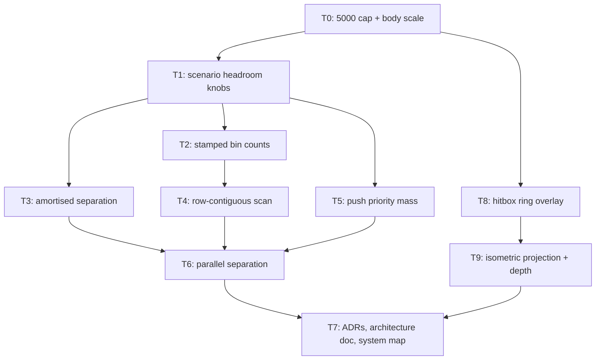

# Plan: Horde Sim Headroom (phase 0.5)

## Goal

Two things, in one branch, in this order.

**First, resize the game.** Decision of 2026-08-09: *make the game feel closer
to StarCraft — fewer entities, but bigger*. The swarm/horde read is bought with
body scale and density, not with population. The absolute simultaneous-entity
ceiling becomes **5 000**, enforced in the scenario contract; nothing in this
repo is run, tested, benchmarked or claimed above it. Sprites grow 30 px → 48 px,
the body radius grows to exactly the sprite half-width so two touching agents no
longer eat into each other's art, every entity draws its own hitbox ring, and
the render layer moves to a 2:1 isometric projection with a real depth order.

**Second, keep the headroom work.** The one loop that scales with agent count is
still the per-agent, per-tick neighbour scan, and the resize makes it *hotter,
not colder*: the body radius goes from `102 q8` to `1536 q8`, so the bin edge
goes from 1 cell to 12 and each agent's 3×3 window covers a far larger
neighbourhood. Five changes from the `They Are Billions` research backlog
(`.tmp/RESEARCH_they_are_billions_performance.md` § C.8, items 1, 3, 5, 8, 9)
land on top, all confined to `crates/mmd-engine/src/sim/`.

Success = **T0 is the only ticket that moves a hash**; every ticket after it
keeps a bit-identical state hash on every tracked scene that does not opt in;
every new simulation capability is scenario data with an identity default; the
zero-allocation invariant still holds on every thread; and the merge gate is
green after each ticket.

## Scope

- In:
  - **Entity ceiling.** `MAX_LIVE_AGENTS = 5_000` in the scenario contract,
    enforced by every validator. `technical_prototype_v1` is retuned in place
    to `5 000 / 5 000`; the merge-gate smoke becomes
    `cargo run -- run --agents 5000 --frames 300`. No command, test, policy
    constant or doc in this repo names a larger population afterwards.
  - **Body scale.** `sprite_size_px` 30 → 48 and `collision_radius_q8`
    102 → 1 536 on the three full-screen scenes. 1 536 q8 = 6 cells = 24 px =
    exactly half a sprite, so contact distance (`2r`) is one full sprite width
    and two touching bodies are edge-to-edge rather than overlapping.
    The `fixture_*` scenes keep their current geometry — see **A17**.
  - **Hitbox ring.** Every entity draws a ring at its *real* body radius, on a
    second pipeline (`shaders/debug_ring.hlsl`), procedural, atlas-free,
    zero-allocation, on by default, toggled with `H`.
  - **Isometric.** A 2:1 world→screen projection at the render layer plus a
    depth-ordered draw (`z` from screen y, alpha-tested cutout) so the 4-atlas
    batching survives. **The simulation stays in Cartesian cell space** — that
    is what keeps every pinned state hash alive.
  - Scenario contract gains three headroom knobs — `separation_phases`,
    `mass_class_count`, `separation_threads` — each defaulting to the identity
    value `1`, each bounded, each rejected on a bodyless scene.
  - **Backlog 1** — amortise the separation pass *and* the grid rebuild across
    `separation_phases` ticks (Reynolds `skipThink`).
  - **Backlog 5** — stamped bin counts in `SpatialGrid`, so a rebuild stops
    clearing `starts` and bin population becomes an O(1) lookup.
  - **Backlog 9 (adapted)** — row-contiguous neighbour scan plus an
    empty-window early-out. See **A3**: Ericson's min-corner 2×2 does **not**
    transfer to a gather loop; the transferable half is delivered instead.
  - **Backlog 8** — per-agent push priority (`mass: Vec<u8>`), so a dense goal
    sink breaks its own symmetry.
  - **Backlog 3** — parallel `accumulate_separation` on a persistent worker
    pool, bit-identical to the serial pass at any thread count.
  - Two tracked scenes demonstrate one knob each: `collision_mid_v1` carries
    `separation_phases: 4`, `collision_sprite_v1` carries `mass_class_count: 2`.
  - `graphify` is now part of the loop: orient with `graphify query`, refresh
    with `graphify update .` at the end of every ticket (**A10**).
  - Docs: ADR 010, ADR 011, ADR 012, ADR index, architecture HTML, close-doc
    system map, glossary.
- Out:
  - **Any performance number, anywhere.** Perf gating stays retired
    (`AGENT.md`, `docs/05-testing.md`). No ticket may pass or fail on a speed
    figure, and no doc under `docs/` may state one. Every ticket's proof is
    behavioural: hashes, invariants, allocation counts. The bench ladder is
    retuned in T0 only so that a frozen policy stops *naming* 50k/100k — it
    stays frozen and non-gating.
  - **Camera control.** T9 centres a fixed view on the destination cell and
    culls what falls outside it. Scrolling, edge-pan, zoom and selection are
    Phase 1.
  - Backlog 2 and 4 (further culling and batching work) beyond the depth
    buffer T9 needs.
  - Flow field. Backlog 6 and 7 (tiling, dirty flags, LOS pass) are Phase 1
    work and land when walls become destructible.
  - Flocking goal propagation (backlog 10) — needs targeting, which is Phase 1.
  - Retuning the `fixture_*` scenes. Their arrival-tick constants are
    calibrated against their current bodies (**A17**).
  - Any new third-party dependency. `rayon` is **not** added — see **A6**.
  - Hard non-overlap. Unchanged from ADR 009: this is steering, overlap is
    bounded, never forbidden. The bigger radius makes overlap *rarer and more
    visible*; it does not make it impossible, and no test or doc may claim
    otherwise.

## Assumptions

- **A1** — Branch is `plan/horde-sim-headroom`, cut from `main`. This assumes
  `plan/zombie-collision` (`108230a`) merges to `main` first. T0 carries the
  `TODO(user)` for that merge and does not proceed until it lands.
- **A2** — Every new *simulation* capability is **scenario data with an identity
  default**, following the `collision_radius_q8` precedent from ADR 009. `1`
  means "behave exactly as the engine did before this plan". That is what makes
  `BODIED_STACK_HASH` and `BODYLESS_GRID_PRE_SEPARATION_HASH` survive T1–T9
  untouched, which is the plan's own regression guard.
- **A3** — **Backlog item 9 as written does not apply to this codebase.**
  Ericson's min-corner binning lets a 2×2 window replace a 3×3 one because each
  *pair* is enumerated once and contributes to both members.
  `accumulate_separation` is a **gather**: for agent `i` it must see every
  neighbour `j`, and a 2×2 window from `i`'s min-corner bin misses every `j`
  whose bin is one lower on either axis. Converting to a symmetric scatter would
  write `sep[j]` from thread `i`'s loop, destroying the index-disjointness T6
  depends on, and would contradict the documented decision in `collision.rs`
  that a truncated pair need not cancel. The transferable half of the item —
  visit fewer, longer runs — is delivered in T4 as a row-contiguous slice, which
  is bit-exact. Recorded in ADR 010.
- **A4** — **Backlog item 5 cannot reach BioDynaMo's O(#agents) rebuild here.**
  The prefix-sum pass over bins is structural to a counting sort; only the
  `starts.fill(0)` pass can go. Reaching O(#agents) means a per-bin linked list
  (loses bucket contiguity, which T4 needs) or a per-tick sort of touched bins.
  Perf is frozen, so it cannot be settled by measurement. T2 therefore ships the
  stamped-count form and earns its keep by giving T4 an O(1) `bin_count`.
  Recorded in ADR 010.
- **A5** — Amortisation stales the grid as well as the repulsion. At
  `separation_phases: 4` a neighbour position is at most 3 ticks old. Bounded
  and accepted: ADR 009 already forbids any zero-overlap claim, so nothing
  stated is weakened. `separation_phases` is scenario data precisely so a
  scenario that cannot tolerate it pins `1`.
- **A6** — **No new dependency.** `rayon`'s parallel bridge has no documented
  allocation-free guarantee, and `crates/mmd-engine/src/alloc_guard.rs` enforces
  zero per-frame allocation as a merge gate. T6 uses `std::thread` + a
  `std::sync::Barrier` in a pool spawned once at `Simulation` construction —
  barrier waits allocate nothing, and thread creation happens outside any
  measured frame. Cost: one small, documented `unsafe impl Send` on the job
  descriptor. The repo already carries `unsafe` in `alloc_guard.rs` and
  `render/renderer.rs`; there is no `forbid(unsafe_code)`.
- **A7** — `alloc_guard.rs` states in its own module doc: *"Introducing a worker
  thread on the frame path means this guard must be revisited before it can
  still claim 'zero allocations per frame'."* T6 pays that debt rather than
  deferring it — workers arm the per-thread counting flag around their chunk, so
  a worker allocation is **counted**, not invisible. The invariant gets stronger,
  not weaker.
- **A8** — Thread count must never change results. Every `sep_x[i]` is written by
  exactly one thread from immutable inputs in an unchanged intra-agent order, so
  the pass is bit-identical at any thread count. That is asserted directly
  (`threads_do_not_change_the_walk`), not argued.
- **A9** — Every tracked scene keeps `separation_threads: 1`. The threaded path
  is proven by inline `GridSpec` tests only. The merge gate must reproduce on a
  host with any core count.
- **A10** — **`graphify` is installed** (`/home/aron/.local/bin/graphify`) and
  `graphify-out/` exists. Supersedes the earlier "not installed on this host"
  note. Every ticket **orients** with `graphify query "<question>"` /
  `graphify explain` / `graphify path` before reading source, and **ends** with
  `graphify update .` (AST-only, no API cost) as its last validation step.
  `graphify-out/` is gitignored (`cf3bee8`), so the refresh never appears in a
  diff and never needs a commit; a ticket that skips it leaves the next ticket
  querying a stale graph. The local CLI also prints
  `skill is from graphify 0.9.36, package is 0.9.37` — harmless; T0 runs
  `graphify install` once to clear it.
- **A11** — Artifacts go to `ai-artifacts/` (the directory that exists and is
  documented in `AGENT.md`), not the skill's default `ai_artefacts/`. Same call
  as `PLAN_2026_08_08_zombie-collision`.
- **A12** — Scenario `.sha256` sidecars are bare lowercase hex, trimmed
  (`Scenario::load_verified`). Regeneration is
  `sha256sum f.ron | cut -d' ' -f1 > f.sha256`. There is no `--check` gate for
  them; the loader is the gate.
- **A13** — T1–T6 add tests but **no new system**: each lands in a file already
  mapped by `SCOPE_SYSTEMS` in `tests/validation_contract.rs`, so only
  `MIN_SCANNED_TESTS` (currently `168`) and the close-doc Collision row move.
  T8 and T9 *do* add systems: T7 raises `SCOPE_SYSTEM_COUNT` from `12` to `14`
  ("Debug hitbox overlay", "Isometric projection and depth order").
- **A14** — `docs/technical-prototype-functional-close.md` is in `LIVE_DOCS`.
  Its edits must avoid every token in `PERF_THRESHOLD_TOKENS` +
  `EXTRA_PERF_CLAIM_TOKENS` (`faster`, `slower`, `per second`, `latency`,
  `throughput`, `fps`, a bare `<digits> ms`, …) or `no_perf_claim_in_docs`
  turns red. `README.md`, `docs/05-testing.md` and `CONTRIBUTING.md` are in the
  same list and T0 edits all of them. ADRs and the architecture HTML are outside
  `LIVE_DOCS`, but this plan keeps them free of speed claims anyway.
- **A15** — **T0 is the single hash-moving ticket, by design.** Retuning
  `technical_prototype_v1` in place changes its `.ron`, its `.sha256` and the
  `hash=` on the gate smoke's `clean exit` line (currently
  `f647e7f590ed5814e4e61388e23836dfacb980217fb1762542ec3abfe85549b3`). T0
  re-pins that digest **once**; T1–T9 must reproduce T0's value exactly. The
  inline `GridSpec` digests (`BODIED_STACK_HASH`,
  `BODYLESS_GRID_PRE_SEPARATION_HASH`) do **not** move in T0 either — T0 changes
  no `GridSpec` default.
- **A16** — Retuning in place, not versioning. `technical_prototype_v1` keeps
  its version id and gets new locked constants (`V1_HARD_AGENTS`,
  `V1_STRETCH_AGENTS`, `V1_SPRITE_PX`, `V1_COLLISION_RADIUS_Q8`). The
  alternative — freeze v1 and add a v2 — leaves a scenario version the loader
  must keep accepting and nothing ever exercises. Chosen deliberately;
  recorded in ADR 012.
- **A17** — **The four `fixture_*` scenes are not retuned.** They are grid-shape
  fixtures, not visual scenes, and their bodies (`collision_radius_q8: 32`) are
  what the arrival-tick constants in `crates/mmd-engine/tests/simulation.rs` are
  calibrated against (dense-fixture first arrival 230, corridor 565, the 400/700
  tick budgets). Growing their bodies would rewrite those constants for no
  gameplay gain. Their populations (64–256 hard, 512 stretch) are already far
  below `MAX_LIVE_AGENTS`, so the cap costs them nothing.
- **A18** — **5 000 × 48 px does not fit a 1920×1080 view, and that is correct.**
  Under T9's 2:1 projection with an 8×4 px tile the 480×270 grid is 3 000×1 500
  screen px — an RTS map larger than its viewport. T9 therefore ships a **fixed**
  camera offset centring the destination cell plus an AABB reject for quads
  fully outside the view. Scrolling is Phase 1 (Out).
- **A19** — **Isometric depth needs no instance-layout change.** `SpriteInstance`
  stays 48 bytes (`instance_layout_is_stable` survives): the vertex stage already
  computes the screen-space `world.y` it needs, and the two normalisation
  scalars land in `FrameUniforms::_pad`, which is already 8 unused bytes. Depth
  correctness with alpha comes from an alpha-test `clip()` in the pixel shader,
  not from sorting — pixel art is effectively 1-bit alpha, so cutout is honest
  and the 4-atlas batching survives.
- **A20** — The hitbox ring is a **second pipeline over the same quad**, not a
  new instance format and not a new atlas. Adding a 5th atlas would break the
  scenario contract's `atlas_count: 4` check and `xtask atlases --check`; a new
  field on `SpriteInstance` would break its pinned layout. The ring reuses
  `SpriteInstance` verbatim — `pos`/`size` give the body's bounding box,
  `uv_rect.xy` carries `(inner, outer)` radius in normalised quad units,
  `tint` is the ring colour — and `PSMain` draws it procedurally. Under T9's
  2:1 quad the same shader renders an ellipse, which is the StarCraft-correct
  read of a circular body on an isometric floor.

## Ticket flowchart

## Ticket order

| ID  | Title | Depends | Commit outcome | File |
| --- | ----- | ------- | -------------- | ---- |
| T0 | StarCraft-scale cap and body | — | 5 000 is the absolute entity ceiling; sprites are 48 px and bodies are half a sprite; the gate digest is re-pinned once | `PLAN_2026_08_09_horde-sim-headroom/T0_starcraft-scale-cap-and-body.md` |
| T1 | Scenario headroom knobs | T0 | Every scenario declares three tuning knobs at their identity values; not one hash moves | `PLAN_2026_08_09_horde-sim-headroom/T1_scenario-headroom-knobs.md` |
| T2 | Stamped bin counts | T1 | `SpatialGrid::rebuild` stops clearing `starts`, and bin population is an O(1) query; bit-exact | `PLAN_2026_08_09_horde-sim-headroom/T2_stamped-bin-counts.md` |
| T3 | Amortised separation | T1 | Separation and the grid rebuild spread over `separation_phases` ticks; `collision_mid_v1` runs at 4 | `PLAN_2026_08_09_horde-sim-headroom/T3_amortised-separation.md` |
| T4 | Row-contiguous neighbour scan | T2 | The 3×3 window is walked as three contiguous runs with an empty-window early-out; bit-exact | `PLAN_2026_08_09_horde-sim-headroom/T4_row-contiguous-scan.md` |
| T5 | Per-agent push priority | T1 | Repulsion is weighted by a per-agent mass byte; `collision_sprite_v1` runs two classes | `PLAN_2026_08_09_horde-sim-headroom/T5_push-priority-mass.md` |
| T6 | Parallel separation pass | T3, T4, T5 | The separation pass runs on a persistent worker pool, bit-identical at any thread count, still zero-alloc | `PLAN_2026_08_09_horde-sim-headroom/T6_parallel-separation.md` |
| T8 | Hitbox ring overlay | T0 | Every entity draws a ring at its real body radius, procedural and zero-alloc, toggled with `H` | `PLAN_2026_08_09_horde-sim-headroom/T8_hitbox-ring-overlay.md` |
| T9 | Isometric projection and depth | T8 | The render layer projects 2:1 isometric and draws depth-ordered; the sim is untouched and every state hash holds | `PLAN_2026_08_09_horde-sim-headroom/T9_isometric-projection-and-depth.md` |
| T7 | ADRs, architecture doc, system map | T6, T9 | Phase 0.5 is a written decision with an enforced test map | `PLAN_2026_08_09_horde-sim-headroom/T7_docs-adr-and-system-map.md` |

## Tickets

- [T0: StarCraft-scale cap and body](PLAN_2026_08_09_horde-sim-headroom/T0_starcraft-scale-cap-and-body.md) — depends: none
- [T1: Scenario headroom knobs](PLAN_2026_08_09_horde-sim-headroom/T1_scenario-headroom-knobs.md) — depends: T0
- [T2: Stamped bin counts](PLAN_2026_08_09_horde-sim-headroom/T2_stamped-bin-counts.md) — depends: T1
- [T3: Amortised separation](PLAN_2026_08_09_horde-sim-headroom/T3_amortised-separation.md) — depends: T1
- [T4: Row-contiguous neighbour scan](PLAN_2026_08_09_horde-sim-headroom/T4_row-contiguous-scan.md) — depends: T2
- [T5: Per-agent push priority](PLAN_2026_08_09_horde-sim-headroom/T5_push-priority-mass.md) — depends: T1
- [T6: Parallel separation pass](PLAN_2026_08_09_horde-sim-headroom/T6_parallel-separation.md) — depends: T3, T4, T5
- [T8: Hitbox ring overlay](PLAN_2026_08_09_horde-sim-headroom/T8_hitbox-ring-overlay.md) — depends: T0
- [T9: Isometric projection and depth](PLAN_2026_08_09_horde-sim-headroom/T9_isometric-projection-and-depth.md) — depends: T8
- [T7: ADRs, architecture doc, system map](PLAN_2026_08_09_horde-sim-headroom/T7_docs-adr-and-system-map.md) — depends: T6, T9

## The retune, in one table

| Field | Before | After | Why |
| ----- | ------ | ----- | --- |
| `MAX_LIVE_AGENTS` | — (implicit 100 000) | `5_000` | Absolute simultaneous-entity ceiling. Nothing is tested above it. |
| `V1_HARD_AGENTS` | `50_000` | `5_000` | The gate scene runs at the ceiling. |
| `V1_STRETCH_AGENTS` | `100_000` | `5_000` | The ceiling removes the stretch tier. |
| `COLLISION_SCENE_MAX_AGENTS` | `20_000` | *removed* | Folded onto `MAX_LIVE_AGENTS`; a second, larger cap would let a demo scene declare 20 000. |
| `FIXTURE_MAX_AGENTS` | `4_096` | `4_096` | Already under the ceiling. |
| `V1_SPRITE_PX` | `30` | `48` | Bigger units, StarCraft read. |
| `V1_COLLISION_RADIUS_Q8` | `102` (0.4 cell, 1.6 px) | `1_536` (6 cells, 24 px) | Exactly half a sprite → contact at one full sprite width → touching bodies stop eating into each other's art. |
| `MAX_COLLISION_RADIUS_Q8` | `2_048` | `2_048` | Unchanged; 1 536 leaves headroom. |
| `bin_size_cells` (derived) | `1.0` | `12.0` | Follows `2 × radius`. This is why T2–T6 still matter. |
| Gate smoke | `--agents 50000` | `--agents 5000` | AGENT.md, README, `docs/05-testing.md`, HANDOFF, both platform docs, `docs/lab/gpu-profiling.md`. |
| `SCALE_COUNTS` | `[1_000, 10_000, 50_000, 100_000]` | `[500, 1_000, 2_500, 5_000]` | A frozen policy must not name a population we refuse to run. |
| `GATE_AGENT_COUNT` / `STRETCH_AGENT_COUNT` | `50_000` / `100_000` | `5_000` / `5_000` | Ceiling collapses stretch onto the gate. |

## Records produced alongside this plan

- [ADR 010 — Separation amortisation, bin stamping and push priority](../docs/ADR/010_ADR_separation_amortisation_and_push_priority.md)
- [ADR 011 — Parallel separation and the allocation invariant](../docs/ADR/011_ADR_parallel_separation_and_the_allocation_invariant.md)
- [ADR 012 — StarCraft-scale entities, hitbox rings and isometric render](../docs/ADR/012_ADR_starcraft_scale_and_isometric_render.md) *(new in T7)*
- [Horde sim headroom architecture (HTML)](../docs/horde-sim-headroom-architecture.html)
- [Plan, rendered (HTML)](PLAN_2026_08_09_horde-sim-headroom.html) — regenerated in T7; stale until then.

## Source

Every simulation decision traces to
`.tmp/RESEARCH_they_are_billions_performance.md`, which carries the
primary-source citation per claim. The four that carry the headroom half:

- Reynolds, *Big Fast Crowds on PS3* (2006) — `skipThink` of 8 and 10 at 15 000
  agents. The amortisation precedent (T3).
- Cheng, *Pathing in Age of Empires IV* (GDC 2022) — steering cost is the
  near-linear term; field cost is not. Why this plan is entirely about the
  neighbour scan.
- Pritchett, *The MAW* (GDC 2022) + Gyrling, *Parallelizing the Naughty Dog
  Engine* — read-only inputs, disjoint writes, swap at the boundary. The shape
  T6 copies.
- Blizzard, *StarCraft II 5.0.15 patch notes* — allied push priority. The
  shipped-RTS answer to a goal sink (T5).

The render half traces to `.tmp/RESEARCH_they_are_billions_performance.md`
§ B.6 (*Rendering 20k+ sprites*) and § B.6.4 (*Isometric depth sorting — the
crux*), and to the project's own direction docs: `docs/CONTEXT.md`
("pixel-art inspired by StarCraft: Brood War", "mechanical RTS gameplay
inspired by StarCraft") and `docs/DESIGN.md` ("clone StarCraft 1 feel before
innovating").
