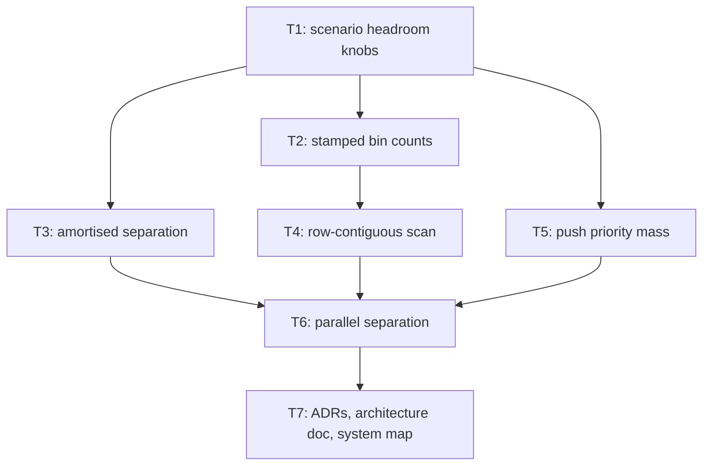

# Plan: Horde Sim Headroom (phase 0.5)

## Goal

Buy simulation headroom in the one loop that scales with agent count — the
per-agent, per-tick neighbour scan — without spending a single behavioural
guarantee. Five changes from the `They Are Billions` research backlog
(`.tmp/RESEARCH_they_are_billions_performance.md` § C.8, items 1, 3, 5, 8, 9),
all confined to `crates/mmd-engine/src/sim/`. Success = every new capability is
scenario data with an identity default, every tracked scene that does not opt in
keeps a **bit-identical state hash**, the zero-allocation invariant still holds
on every thread, and the merge gate is green after each ticket.

## Scope

- In:
  - Scenario contract gains three headroom knobs — `separation_phases`,
    `mass_class_count`, `separation_threads` — each defaulting to the identity
    value `1`, each bounded, each rejected on a bodyless scene.
  - **Backlog 1** — amortise the separation pass *and* the grid rebuild across
    `separation_phases` ticks (Reynolds `skipThink`).
  - **Backlog 5** — stamped bin counts in `SpatialGrid`, so a rebuild stops
    clearing `starts` and bin population becomes an O(1) lookup.
  - **Backlog 9 (adapted)** — row-contiguous neighbour scan plus an
    empty-window early-out. See **A3**: Ericson's min-corner 2×2 does **not**
    transfer to a gather loop; the transferable half is delivered instead.
  - **Backlog 8** — per-agent push priority (`mass: Vec<u8>`), so a dense goal
    sink breaks its own symmetry.
  - **Backlog 3** — parallel `accumulate_separation` on a persistent worker
    pool, bit-identical to the serial pass at any thread count.
  - Two tracked scenes demonstrate one knob each: `collision_mid_v1` carries
    `separation_phases: 4`, `collision_sprite_v1` carries `mass_class_count: 2`.
  - Docs: ADR 010, ADR 011, ADR index, architecture HTML, close-doc system map,
    glossary.
- Out:
  - **Any performance number, anywhere.** Perf gating stays retired
    (`AGENT.md`, `docs/05-testing.md`). No ticket may pass or fail on a speed
    figure, and no doc under `docs/` may state one. Every ticket's proof is
    behavioural: hashes, invariants, allocation counts.
  - Renderer, shaders, culling, isometric depth. Backlog 2 and 4 are a separate
    plan (`shaders/sprite.hlsl` still writes `z = 0.0`; that is untouched here).
  - Flow field. Backlog 6 and 7 (tiling, dirty flags, LOS pass) are Phase 1
    work and land when walls become destructible.
  - Flocking goal propagation (backlog 10) — needs targeting, which is Phase 1.
  - Changing the gate scene's walk. `technical_prototype_v1` stays pinned to the
    identity tuning; a later, reviewed commit may opt it in.
  - Any new third-party dependency. `rayon` is **not** added — see **A6**.
  - Hard non-overlap. Unchanged from ADR 009: this is steering, overlap is
    bounded, never forbidden. No test or doc may claim otherwise.

## Assumptions

- **A1** — Branch is `plan/horde-sim-headroom`, cut from `main`. This assumes
  `plan/zombie-collision` (`108230a`) merges to `main` first. T1 carries the
  `TODO(user)` for that merge and does not proceed until it lands.
- **A2** — Every new capability is **scenario data with an identity default**,
  following the `collision_radius_q8` precedent from ADR 009. `1` means "behave
  exactly as the engine did before this plan". That is what makes
  `BODIED_STACK_HASH` and `BODYLESS_GRID_PRE_SEPARATION_HASH` survive the whole
  plan untouched, which is the plan's own regression guard.
- **A3** — **Backlog item 9 as written does not apply to this codebase.**
  Ericson's min-corner binning lets a 2×2 window replace a 3×3 one because each
  *pair* is enumerated once and contributes to both members.
  `accumulate_separation` is a **gather**: for agent `i` it must see every
  neighbour `j`, and a 2×2 window from `i`'s min-corner bin misses every `j`
  whose bin is one lower on either axis. Converting to a symmetric scatter would
  write `sep[j]` from thread `i`'s loop, destroying the index-disjointness T6
  depends on, and would contradict the documented decision in `collision.rs`
  that a truncated pair need not cancel. The transferable half of the item —
  visit fewer, longer runs — is delivered in T4 as a row-contiguous slice, which
  is bit-exact. Recorded in ADR 010.
- **A4** — **Backlog item 5 cannot reach BioDynaMo's O(#agents) rebuild here.**
  The prefix-sum pass over bins is structural to a counting sort; only the
  `starts.fill(0)` pass can go. Reaching O(#agents) means a per-bin linked list
  (loses bucket contiguity, which T4 needs) or a per-tick sort of touched bins
  (~50 000 keys against ~129 600 streamed words — no reason to believe that
  trades well, and perf is frozen so it cannot be settled by measurement). T2
  therefore ships the stamped-count form and earns its keep by giving T4 an O(1)
  `bin_count`. Recorded in ADR 010.
- **A5** — Amortisation stales the grid as well as the repulsion. At
  `separation_phases: 4` a neighbour position is at most 3 ticks old. Bounded
  and accepted: ADR 009 already forbids any zero-overlap claim, so nothing
  stated is weakened. `separation_phases` is scenario data precisely so a
  scenario that cannot tolerate it pins `1`.
- **A6** — **No new dependency.** `rayon`'s parallel bridge has no documented
  allocation-free guarantee, and `crates/mmd-engine/src/alloc_guard.rs` enforces
  zero per-frame allocation as a merge gate. T6 uses `std::thread` + a
  `std::sync::Barrier` in a pool spawned once at `Simulation` construction —
  barrier waits allocate nothing, and thread creation happens outside any
  measured frame. Cost: one small, documented `unsafe impl Send` on the job
  descriptor. The repo already carries `unsafe` in `alloc_guard.rs` and
  `render/renderer.rs`; there is no `forbid(unsafe_code)`.
- **A7** — `alloc_guard.rs` states in its own module doc: *"Introducing a worker
  thread on the frame path means this guard must be revisited before it can
  still claim 'zero allocations per frame'."* T6 pays that debt rather than
  deferring it — workers arm the per-thread counting flag around their chunk, so
  a worker allocation is **counted**, not invisible. The invariant gets stronger,
  not weaker.
- **A8** — Thread count must never change results. Every `sep_x[i]` is written by
  exactly one thread from immutable inputs in an unchanged intra-agent order, so
  the pass is bit-identical at any thread count. That is asserted directly
  (`threads_do_not_change_the_walk`), not argued.
- **A9** — Every tracked scene keeps `separation_threads: 1`. The threaded path
  is proven by inline `GridSpec` tests only. The merge gate must reproduce on a
  host with any core count.
- **A10** — `graphify` is documented in `AGENT.md` but the CLI is not installed
  on this host (`graphify: command not found`). No ticket runs `graphify
  update .`; T1 restates the note for the user.
- **A11** — Artifacts go to `ai-artifacts/` (the directory that exists and is
  documented in `AGENT.md`), not the skill's default `ai_artefacts/`. Same call
  as `PLAN_2026_08_08_zombie-collision`.
- **A12** — Scenario `.sha256` sidecars are bare lowercase hex, trimmed
  (`Scenario::load_verified`). Regeneration is
  `sha256sum f.ron | cut -d' ' -f1 > f.sha256`. There is no `--check` gate for
  them; the loader is the gate.
- **A13** — Adding tests raises the scanned-test total but adds **no new
  system**: every new test lands in a file already mapped by
  `SCOPE_SYSTEMS` in `tests/validation_contract.rs`. `SCOPE_SYSTEM_COUNT`
  stays `12`; only `MIN_SCANNED_TESTS` and the close-doc Collision row move.
- **A14** — `docs/technical-prototype-functional-close.md` is in `LIVE_DOCS`.
  Its edit in T7 must avoid every token in `PERF_THRESHOLD_TOKENS` +
  `EXTRA_PERF_CLAIM_TOKENS` (`faster`, `slower`, `per second`, `latency`,
  `throughput`, `fps`, a bare `<digits> ms`, …) or `no_perf_claim_in_docs`
  turns red. ADRs and the new architecture HTML are outside `LIVE_DOCS`, but
  this plan keeps them free of speed claims anyway.

## Ticket flowchart

## Ticket order

| ID  | Title | Depends | Commit outcome | File |
| --- | ----- | ------- | -------------- | ---- |
| T1 | Scenario headroom knobs | — | Every scenario declares three tuning knobs at their identity values; not one hash moves | `PLAN_2026_08_09_horde-sim-headroom/T1_scenario-headroom-knobs.md` |
| T2 | Stamped bin counts | T1 | `SpatialGrid::rebuild` stops clearing `starts`, and bin population is an O(1) query; bit-exact | `PLAN_2026_08_09_horde-sim-headroom/T2_stamped-bin-counts.md` |
| T3 | Amortised separation | T1 | Separation and the grid rebuild spread over `separation_phases` ticks; `collision_mid_v1` runs at 4 | `PLAN_2026_08_09_horde-sim-headroom/T3_amortised-separation.md` |
| T4 | Row-contiguous neighbour scan | T2 | The 3×3 window is walked as three contiguous runs with an empty-window early-out; bit-exact | `PLAN_2026_08_09_horde-sim-headroom/T4_row-contiguous-scan.md` |
| T5 | Per-agent push priority | T1 | Repulsion is weighted by a per-agent mass byte; `collision_sprite_v1` runs two classes | `PLAN_2026_08_09_horde-sim-headroom/T5_push-priority-mass.md` |
| T6 | Parallel separation pass | T3, T4, T5 | The separation pass runs on a persistent worker pool, bit-identical at any thread count, still zero-alloc | `PLAN_2026_08_09_horde-sim-headroom/T6_parallel-separation.md` |
| T7 | ADRs, architecture doc, system map | T6 | Phase 0.5 is a written decision with an enforced test map | `PLAN_2026_08_09_horde-sim-headroom/T7_docs-adr-and-system-map.md` |

## Tickets

- [T1: Scenario headroom knobs](PLAN_2026_08_09_horde-sim-headroom/T1_scenario-headroom-knobs.md) — depends: none
- [T2: Stamped bin counts](PLAN_2026_08_09_horde-sim-headroom/T2_stamped-bin-counts.md) — depends: T1
- [T3: Amortised separation](PLAN_2026_08_09_horde-sim-headroom/T3_amortised-separation.md) — depends: T1
- [T4: Row-contiguous neighbour scan](PLAN_2026_08_09_horde-sim-headroom/T4_row-contiguous-scan.md) — depends: T2
- [T5: Per-agent push priority](PLAN_2026_08_09_horde-sim-headroom/T5_push-priority-mass.md) — depends: T1
- [T6: Parallel separation pass](PLAN_2026_08_09_horde-sim-headroom/T6_parallel-separation.md) — depends: T3, T4, T5
- [T7: ADRs, architecture doc, system map](PLAN_2026_08_09_horde-sim-headroom/T7_docs-adr-and-system-map.md) — depends: T6

## Records produced alongside this plan

- [ADR 010 — Separation amortisation, bin stamping and push priority](../docs/ADR/010_ADR_separation_amortisation_and_push_priority.md)
- [ADR 011 — Parallel separation and the allocation invariant](../docs/ADR/011_ADR_parallel_separation_and_the_allocation_invariant.md)
- [Horde sim headroom architecture (HTML)](../docs/horde-sim-headroom-architecture.html)
- [Plan, rendered (HTML)](PLAN_2026_08_09_horde-sim-headroom.html)

## Source

Every decision traces to `.tmp/RESEARCH_they_are_billions_performance.md`, which
carries the primary-source citation per claim. The four that carry this plan:

- Reynolds, *Big Fast Crowds on PS3* (2006) — `skipThink` of 8 and 10 at 15 000
  agents. The amortisation precedent (T3).
- Cheng, *Pathing in Age of Empires IV* (GDC 2022) — steering cost is the
  near-linear term; field cost is not. Why this plan is entirely about the
  neighbour scan.
- Pritchett, *The MAW* (GDC 2022) + Gyrling, *Parallelizing the Naughty Dog
  Engine* — read-only inputs, disjoint writes, swap at the boundary. The shape
  T6 copies (T6).
- Blizzard, *StarCraft II 5.0.15 patch notes* — allied push priority. The
  shipped-RTS answer to a goal sink (T5).
