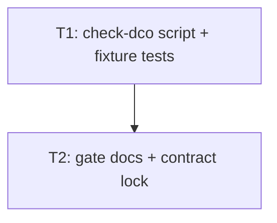

# Plan: audit issue #10 DCO range gate

## Goal

Add tracked offline DCO range checker `./scripts/check-dco <trusted-base-sha> <exact-candidate-sha>`. Wire into authoritative required merge gate + CONTRIBUTING. Prove unsigned range fails (names hashes) and signed range passes. Success = script + contract tests green; gate docs list exact cmd; legacy main history never revalidated/rewritten.

## Scope

- In: `scripts/check-dco`; `tests/dco_range_gate.rs`; gate lock in `tests/validation_contract.rs`; fence + prose in `docs/05-testing.md`; mirror fences in `README.md` + `AGENT.md` (same command list already mirrored; leave stale → agent/doc drift); CONTRIBUTING DCO/PR prose; automated tests only (no GitHub Actions).
- Out: other audit findings; CI redesign; identity/email crypto beyond trailer presence; rewriting/revalidating existing unsigned main history; GPG/SSH commit signatures; GitHub App/status checks; changes to game/engine code.

## Assumptions

- Autonomous defaults (no grill).
- Trailer presence only: valid `Signed-off-by: Name <email>` via `git interpret-trailers --parse` + documented value regex. No email ownership proof.
- Range = commits reachable from candidate not from base: `git rev-list --reverse <base>..<candidate>` (base exclusive, candidate inclusive). Empty range (base == candidate) → exit 0.
- Trusted base chosen by maintainer (typical: `git merge-base main <candidate>` or main tip that is ancestor). Script never walks full root→HEAD unless operator passes root.
- Put DCO cmd **first** in required-gate fence → fail-fast before long cargo/nix work.
- Exit codes: `0` pass; `1` policy fail (missing trailer / non-descendant); `2` usage / unresolvable rev.
- Missing trailers: print **all** offenders then exit 1 (no fail-fast on first).
- Success silent (no required stdout).
- Tests use **throwaway temp git repos** only (`tempfile::TempDir`); never rewrite this worktree history.
- `README.md` must gain same fence line as `docs/05-testing.md` because `required_gate_*` tests already scan both.
- `AGENT.md` merge-gate block updated same way (duplicate list; SSoT remains `docs/05-testing.md`).
- No new ADR: ADR 008 already requires DCO; this adds offline enforcement only.
- No HTML plan / architecture docs (caller override).
- Bash script (`#!/usr/bin/env bash`, `set -euo pipefail`) matches `lab/provision/*` style.
- `tempfile` already root `[dev-dependencies]` → integration tests may use it.

## Ticket flowchart

## Ticket order

| ID | Title | Depends | Commit outcome | File |
| --- | --- | --- | --- | --- |
| T1 | Offline DCO range script + behavioral tests | — | `./scripts/check-dco` enforces signed range; temp-repo tests green | `PLAN_2026_08_14_audit_issue_10_dco_range_gate/T1_check-dco-script-and-tests.md` |
| T2 | Wire required merge gate + CONTRIBUTING + doc contract | T1 | Gate docs list DCO cmd; `required_gate_contains_dco_check` locks it | `PLAN_2026_08_14_audit_issue_10_dco_range_gate/T2_gate-docs-and-contract.md` |

## Tickets

- [T1: Offline DCO range script + behavioral tests](PLAN_2026_08_14_audit_issue_10_dco_range_gate/T1_check-dco-script-and-tests.md) — depends: none
- [T2: Wire required merge gate + CONTRIBUTING + doc contract](PLAN_2026_08_14_audit_issue_10_dco_range_gate/T2_gate-docs-and-contract.md) — depends: T1
