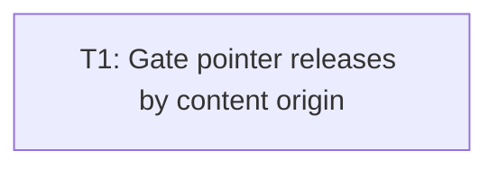

# Plan: Audit issue #1 — bar-origin pointer actions

## Goal

Block live left/right actions unless button-down plus button-up both occur inside aspect-fit RTS canvas. Preserve valid click, shift-click, drag, right-order, edge-pan behavior; prove routing without SDL display.

## Scope

- In: live pointer button-down ownership; left/right release routing; focus-loss button-state clear; focused unit regressions; T8 manual checklist update.
- Out: stale resize viewport (F2); focus pause behavior (F3) beyond button-state clear; scripted input semantics; app-wide input refactor; other audit findings.

## Assumptions

- `DisplayViewport::map_pointer` remains source for `MappedPointer::inside_content`; viewport math already has separate coverage.
- Left/right button state stays independent. Shift remains sampled on left release.
- Mouse motion still routes clamped logical coords from bars → edge-pan unchanged.
- Script-built `RtsCommand` values bypass live pointer gesture state → replay contract unchanged.
- Live compositor proof remains human-only → checklist records gesture regression.

## Ticket flowchart

## Ticket order

| ID | Title | Depends | Commit outcome | File |
| --- | --- | --- | --- | --- |
| T1 | Gate pointer releases by content origin | — | Bar-origin/focus-interrupted left/right gestures emit no command; valid gestures still route. | `PLAN_2026_08_14_audit_issue_1_bar_origin_pointer_actions/T1_gate_pointer_releases_by_content_origin.md` |

## Tickets

- [T1: Gate pointer releases by content origin](PLAN_2026_08_14_audit_issue_1_bar_origin_pointer_actions/T1_gate_pointer_releases_by_content_origin.md) — depends: none
