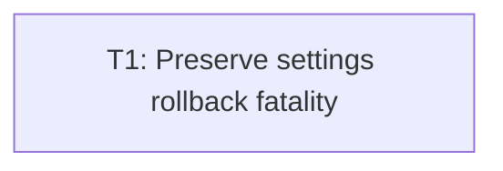

# Plan: Audit issue 4 — settings rollback fatality

## Goal

Keep settings primary failures recoverable only after verified rollback. Any failed window/audio compensation becomes fatal, reaches live session teardown after required GPU reclaim, preserves primary + compensation context.

## Scope

- In: `rts_ui` transaction classification/compensation; narrow `rts_window` mode-error + test-fake seams; narrow audio fake fault schedule; live/scripted caller propagation; focused tests; manual checklist note.
- Out: other audit findings; settings schema/UI redesign; persistence protocol changes; unrelated window/audio/UI refactor; app impl in this planning commit.

## Assumptions

- One commit-sized TDD slice suffices: error type, compensation, live propagation form one inseparable transaction contract.
- Reverse compensation order = audio gains, then window runtime. Both attempts run even if first fails; fatal text retains every failure.
- `LiveCommit.result` remains soft-only: `Err(String)` means primary failed + rollback verified. Fatal transaction errors use outer `Err(String)` from `commit_setting_change_live`.
- Mode-change fatality returns only after `reclaim`; fatal path skips `viewport` because session exits.
- Native double-failure injection unsafe/non-portable; production-seam fakes provide automated proof. Manual checklist covers ordinary recoverable save rollback plus proof boundary.

## Ticket flowchart

## Ticket order

| ID | Title | Depends | Commit outcome | File |
| --- | --- | --- | --- | --- |
| T1 | Preserve settings rollback fatality | — | Verified rollback warns; failed compensation aborts live session after reclaim | `PLAN_2026_08_14_audit_issue_4_settings_rollback_fatality/T1_preserve-settings-rollback-fatality.md` |

## Tickets

- [T1: Preserve settings rollback fatality](PLAN_2026_08_14_audit_issue_4_settings_rollback_fatality/T1_preserve-settings-rollback-fatality.md) — depends: none
