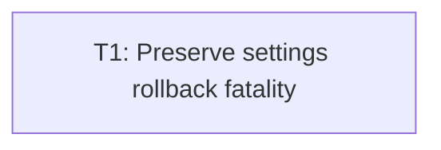

# Plan: Audit issue 4 — settings rollback fatality

## Goal

Keep settings primary failures recoverable only after verified rollback. Any failed window/audio compensation becomes fatal, reaches live `MouseButtonUp` teardown after required GPU reclaim, preserves txn primary + every compensation + lifecycle context.

## Scope

- In: `rts_ui` txn classification/compensation; narrow `rts_window` mode error; deterministic window/audio fault schedules; live `MouseButtonUp` teardown seam; scripted pre-latched fatal composition; focused tests; manual checklist note.
- Out: other audit findings; settings schema/UI redesign; persistence protocol changes; unrelated window/audio/UI refactor; app impl in this planning commit.

## Assumptions

- One commit-sized TDD slice suffices: seam prep, typed errors, compensation, caller propagation form one txn contract.
- Seam-first prep compiles green before behavioral reds; every red uses existing prod APIs + prep seams, never later Green-only types.
- Reverse compensation order = audio gains, then window runtime. All attempts run; fatal text retains txn primary + every compensation.
- `LiveCommit.result` remains soft-only: `Err(String)` means primary failed + rollback verified. Fatal txn errors use outer `Err(String)`.
- Mode fatality returns after one `reclaim`; fatal path skips `viewport`. Combined txn/reclaim errors retain both contexts.
- Scripted settings fatal composes with pre-latched `audio_fatal`; no `get_or_insert` context loss.
- Native double-failure injection unsafe/non-portable; production-seam fakes prove logic. Manual checklist states proof boundary.

## Ticket flowchart

## Ticket order

| ID | Title | Depends | Commit outcome | File |
| --- | --- | --- | --- | --- |
| T1 | Preserve settings rollback fatality | — | Verified rollback warns; failed compensation aborts live session after reclaim | `PLAN_2026_08_14_audit_issue_4_settings_rollback_fatality/T1_preserve-settings-rollback-fatality.md` |

## Tickets

- [T1: Preserve settings rollback fatality](PLAN_2026_08_14_audit_issue_4_settings_rollback_fatality/T1_preserve-settings-rollback-fatality.md) — depends: none
