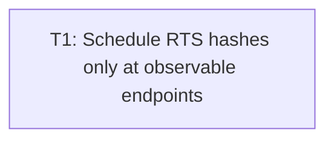

# Plan: Audit issue #6 — RTS endpoint hash scheduling

## Goal

Remove redundant full `RtsWorld::state_hash` work from intermediate RTS frames. Preserve byte-exact same-host `frame0`/clean-exit hash semantics on every clean stop. Prove bounded production-seam hash calls. Fatal still beats quit. No portable cross-host hash-literal gate.

## Scope

- In: `src/rts_run.rs` endpoint schedule + live batch preflight/post-event spine; `src/rts_script.rs` quit preflight peek; focused app-unit production-seam tests; offscreen/controlled CLI endpoint equality; inline stdout contract comment.
- Out: `RtsWorld::state_hash` body; F1/F2/F3 input fixes; horde `run`; F8; broad runtime refactor; perf/timing gates; unconditional workspace hash literals; uncontrolled real-window exact-hash asserts; external docs/checklist unless impl exposes contract drift.

## Assumptions

- Autonomous mode. Safest in-scope design fixed below; zero impl choice left.
- One commit-sized ticket: scheduler + script preflight + live terminal spine + tests land atomic.
- Current `KEY_BINDINGS` maps no key to `RtsCommand::Quit`; keep that. Key-quit classifier stays semantic/future-safe.
- `Event::AppTerminating` / non-`Quit` window-close events stay ignored (current behavior).
- Clean-exit hash = last **successfully rendered** world. Live/script mutation after that render must not replace it.
- Scripted quit after ordinary live mutation requires **pre-batch** capture via `RtsScript` preflight; explicit `Event::Quit`/key-Quit alone is not enough.
- Fatal+quit may take **one** terminal-candidate snapshot before fatal is known; `finish` stays unreachable; no `rts: clean exit`.
- Endpoint hash bytes stay same-host only. Permanent tests derive expectations from same-host dual runs or direct `RtsWorld` oracle ticks — never unconditional Linux/Vulkan literals as workspace gate.
- Linux/Vulkan literals recorded in T1 are optional attestation notes only.
- No ADR / architecture HTML / checklist / glossary change: private schedule optimization; stdout field set unchanged.
- `pack_frame`/UI packing may allocate; F7 proof is hash call-count (no intermediate `state_hash`), not full-frame zero-alloc under `MeasureGuard`.

## Ticket flowchart

## Ticket order

| ID | Title | Depends | Commit outcome | File |
| --- | --- | --- | --- | --- |
| T1 | Schedule RTS hashes only at observable endpoints | — | Production RTS hashes only initial/frame-1/final-required states; scripted/live quit keep last-rendered hash; fatal beats quit; same-host endpoints unchanged | `PLAN_2026_08_14_audit_issue_6_rts_per_frame_hash/T1_schedule-rts-endpoint-hashes.md` |

## Tickets

- [T1: Schedule RTS hashes only at observable endpoints](PLAN_2026_08_14_audit_issue_6_rts_per_frame_hash/T1_schedule-rts-endpoint-hashes.md) — depends: none
