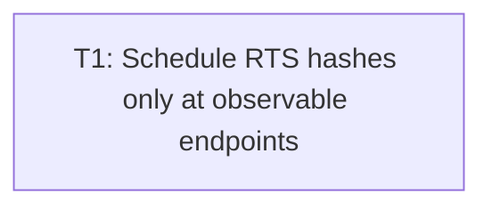

# Plan: Audit issue #6 — RTS endpoint hash scheduling

## Goal

Remove redundant full `RtsWorld::state_hash` work from intermediate RTS frames. Preserve byte-exact `frame0`/clean-exit hash semantics across every clean stop; prove bounded hash calls, zero intermediate hash allocations, exact stdout hashes, cross-process determinism.

## Scope

- In: `src/rts_run.rs` hash schedule; minimal private test seams; focused app-unit/RTS CLI tests; inline endpoint contract comment.
- Out: `RtsWorld::state_hash`; F1/F2/F3 input fixes; horde `run`; F8; broad runtime refactor; perf/timing gates; external docs/checklist unless implementation exposes contract drift.

## Assumptions

- Autonomous mode. Safest in-scope design selected from current code.
- One commit-sized ticket sufficient: scheduler + terminal-batch preservation + tests must land atomically; splitting creates compile-red or unproved semantics.
- Current key table intentionally maps no key to `RtsCommand::Quit`; plan preserves this. Key-quit classifier stays semantic/future-safe because live loop already checks `session.quit` after key commands.
- `Event::AppTerminating` remains ignored: current loop treats only `Event::Quit` as SDL terminal input.
- Terminal batch pre-snapshot is unavoidable only when explicit quit exists: otherwise earlier same-batch world mutation destroys last-rendered hash before clean exit.
- No ADR, external architecture doc, manual checklist, glossary change needed: private scheduling optimization; stdout/world contracts unchanged.

## Ticket flowchart

## Ticket order

| ID | Title | Depends | Commit outcome | File |
| --- | --- | --- | --- | --- |
| T1 | Schedule RTS hashes only at observable endpoints | — | RTS hashes initial/frame 1/final-required states only; every clean-exit hash stays exact | `PLAN_2026_08_14_audit_issue_6_rts_per_frame_hash/T1_schedule-rts-endpoint-hashes.md` |

## Tickets

- [T1: Schedule RTS hashes only at observable endpoints](PLAN_2026_08_14_audit_issue_6_rts_per_frame_hash/T1_schedule-rts-endpoint-hashes.md) — depends: none
