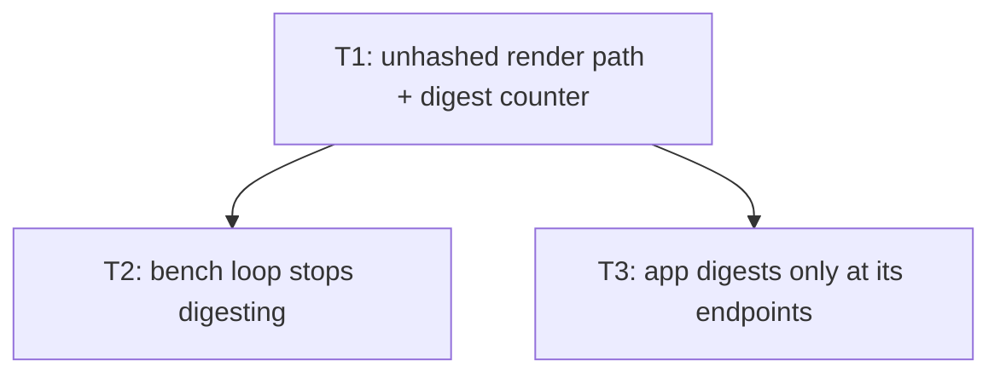

# Plan: audit issue #7 — horde per-frame state hash

## Goal

`Runtime::tick_and_render` digests the whole simulation every frame
(`crates/mmd-engine/src/runtime.rs:465`), but only two frames of a run consume a
digest (`src/run.rs:296,552,555,632-635`) and the frozen bench consumes none
(`crates/mmd-engine/src/bench/runner.rs:318`). Add an API-preserving unhashed
render entry, move the app to endpoint-only digests, stop the bench digesting —
with byte-identical stdout hashes and a pinned per-seam digest budget.

Success = every pinned endpoint hash below reproduces byte-for-byte, the hashed
`FrameOutput` API is untouched, and three production seams prove their digest
count: `Runtime` (1 per hashed frame, 0 per unhashed frame), `src/run.rs`
(2 per run, 1 for a quit before frame 1), bench `run_phase` (0).

## Scope

- In: `Runtime::tick_and_render` hash scheduling, new
  `Runtime::tick_and_render_unhashed` + `RenderOutput`, digest counter
  `Runtime::state_hash_calls`, `src/run.rs` endpoint hashing, frozen bench path
  `crates/mmd-engine/src/bench/runner.rs`, focused tests in
  `crates/mmd-engine/tests/runtime_frame.rs`, `crates/mmd-engine/src/bench/runner.rs`
  (`#[cfg(test)] mod tests`), `src/run.rs` (`#[cfg(test)] mod tests`).
- Out: RTS issue #6 hashing (`RtsWorld::state_hash`, `src/rts_run.rs`) — separate,
  blocked. Collision/nav work. Any timing gate or perf number. Changing the digest
  bytes of `Simulation::state_hash` / `quantized_state_hash`. Changing
  `FrameOutput`, `Harness::render_frame`, `Harness::state_hash`, or any stdout
  line. `docs/05-testing.md`, `AGENT.md`, ADRs.

## Decisions (locked — worker decides nothing)

1. **Split, not opt-in flag.** `FrameOutput` keeps `state_hash` and stays the
   return of `tick_and_render`. New sibling `RenderOutput` = same 7 fields minus
   `state_hash`, returned by new `tick_and_render_unhashed`. Both delegate to a
   new private `Runtime::tick_and_pack() -> FrameStats`, so tick/pack/stat
   behaviour cannot drift between them. A bool/opt-in parameter is rejected: it
   would change the existing signature.
2. **Counter lives on `Runtime`, always compiled** — `state_hash_calls: AtomicU64`,
   bumped inside `Runtime::state_hash`, read by `Runtime::state_hash_calls() -> u64`.
   Not `testkit`-gated: the app crate takes `mmd-engine` with
   `default-features = false, features = ["gpu"]` (`Cargo.toml:15`) and
   `cargo tree -e features | grep -c testkit` must stay `0` (`AGENT.md:94`), so a
   gated counter would be invisible to `src/run.rs` unit tests and adding a
   testkit dev-dependency would break that tracked invariant.
3. **Uncounted observation channel** = `Runtime::sim().state_hash()`
   (`Runtime::sim` and `Simulation::state_hash` are both already `pub`, ungated).
   Every count test reads digest *bytes* through it, so an observation never moves
   the budget it asserts.
4. **App endpoints** = `runtime.state_hash()` once right after the frame-1
   `step_frame` (feeds the `frame0` line) and once inside `finish` (feeds the
   `clean exit` line). `RunState.first_hash` / `RunState.last_hash` are deleted:
   nothing mutates the sim between the last `tick_and_render*` and `finish`, so
   `runtime.state_hash()` at exit is bit-identical to the old `last_hash` on every
   path, including quit-before-frame-1 (`tick=0`).
5. **Bench never digests**: `run_phase` uses `tick_and_render_unhashed`. Bench
   report bytes are untouched (the hash was already discarded).
6. **No new clean-exit path.** `finish` stays the only printer of `run: clean exit`;
   fatal/render-error paths keep returning `Err` and print nothing.

## Assumptions

- Digest bytes and tick behaviour are frozen; this plan only moves *when* a digest
  is taken, never what it covers.
- The gate scene and endpoint hashes pinned in T3 were captured on this worktree
  at `e7fe9dee0277d84da78f6436832aa05e3f95f71d`, `SDL_VIDEODRIVER=offscreen`,
  `backend=vulkan`. `Simulation::state_hash` is a same-platform digest (raw f32
  bits) — the pins are host-stable, not cross-platform claims.
- `-p millions_must_die --test rts_cli_contract` has a **pre-existing** parallel
  flake on this host: `no_rts_run_creates_the_real_user_config` and
  `dummy_driver_run_does_not_touch_settings` fail together under the default
  thread count and pass with `-- --test-threads=1` (56/56). Unrelated to this
  plan; T3's validation names the single-threaded form.
- `cargo test --workspace` builds `mmd-engine` with `testkit` on (its own default
  features), so unit tests added in engine `src/` must not depend on `testkit`.

## Ticket flowchart

## Ticket order

| ID  | Title                                  | Depends | Commit outcome                                                                                   | File                                                                          |
| --- | -------------------------------------- | ------- | ------------------------------------------------------------------------------------------------ | ----------------------------------------------------------------------------- |
| T1  | Unhashed render path + digest counter  | —       | `Runtime::tick_and_render_unhashed` + `RenderOutput` + `Runtime::state_hash_calls` ship; hashed `FrameOutput` API and every caller unchanged | `PLAN_2026_08_14_audit_issue_7_horde_per_frame_hash/T1_unhashed-render-path.md` |
| T2  | Bench loop stops digesting             | T1      | Frozen bench measured loop takes 0 digests, proven at `run_phase`                                  | `PLAN_2026_08_14_audit_issue_7_horde_per_frame_hash/T2_bench-loop-stops-digesting.md` |
| T3  | App digests only at its endpoints      | T1      | `run` takes 2 digests per run (1 on quit-before-frame-1); every pinned stdout hash byte-identical  | `PLAN_2026_08_14_audit_issue_7_horde_per_frame_hash/T3_app-digests-only-at-endpoints.md` |

T2 and T3 are independent of each other; run T2 then T3 for a linear history.

## Tickets

- [T1: Unhashed render path + digest counter](PLAN_2026_08_14_audit_issue_7_horde_per_frame_hash/T1_unhashed-render-path.md) — depends: none
- [T2: Bench loop stops digesting](PLAN_2026_08_14_audit_issue_7_horde_per_frame_hash/T2_bench-loop-stops-digesting.md) — depends: T1
- [T3: App digests only at its endpoints](PLAN_2026_08_14_audit_issue_7_horde_per_frame_hash/T3_app-digests-only-at-endpoints.md) — depends: T1

## Measured baselines (this worktree, `e7fe9de`)

| Suite | Command | Baseline |
| --- | --- | --- |
| runtime frame | `cargo test -p mmd-engine --test runtime_frame --locked` | `running 6 tests` … `6 passed` |
| engine unit | `cargo test -p mmd-engine --lib --locked` | `running 56 tests` … `56 passed` |
| bench policy | `cargo test -p mmd-engine --test benchmark_policy --locked` | `running 12 tests` … `12 passed` |
| harness | `cargo test -p mmd-engine --test harness --locked` | `running 12 tests` … `11 passed; 1 ignored` |
| app unit | `cargo test -p millions_must_die --bin millions_must_die --locked` | `running 95 tests` … `95 passed` |
| CLI contract | `MMD_REQUIRE_GPU=1 cargo test --locked --test cli_contract` | `running 25 tests` … `25 passed` |

After T1: runtime frame `9`. After T2: engine unit `57`. After T3: app unit `99`.
Every other line stays at its baseline.

`-p millions_must_die --test rts_cli_contract` is `56 passed` with
`-- --test-threads=1` and `54 passed; 2 failed` under the default thread count —
**before** any change in this plan (pre-existing parallel flake, see Assumptions).

## Pre-verification (planning evidence, not delivered code)

Every edit and test in T1-T3 was applied verbatim to a throwaway copy of this
worktree (`/tmp/t7check`, since deleted) and run. The worktree source is
untouched; only plan docs are committed. Results there:

| Check | Result |
| --- | --- |
| `cargo test -p mmd-engine --test runtime_frame --locked` | `9 passed; 0 failed` |
| `cargo test -p mmd-engine --lib --locked` | `57 passed; 0 failed` |
| `cargo test -p mmd-engine --lib --locked -- --exact bench::runner::tests::the_measured_loop_never_digests` | `1 passed`, `56 filtered out` |
| `cargo test -p millions_must_die --bin millions_must_die --locked` | `99 passed; 0 failed` |
| `MMD_REQUIRE_GPU=1 cargo test --locked --test cli_contract` | `25 passed; 0 failed` |
| `cargo test -p mmd-engine --test harness --locked` | `11 passed; 1 ignored` |
| `cargo test -p mmd-engine --test benchmark_policy --locked` | `12 passed; 0 failed` |
| `MMD_REQUIRE_GPU=1 cargo test --workspace --locked` | only the pre-existing `rts_cli_contract` parallel flake fails; `-- --test-threads=1` → `56 passed` |
| `cargo fmt --all -- --check` | clean |
| `cargo clippy --workspace --all-targets --all-features -- -D warnings` | `Finished`, no warnings |
| endpoint hashes (`--frames 3`, `--frames 1`, `1:esc`, `1:space`, `5000/300`) | byte-identical to the pins in T3 |
| `cargo run -- run --agents 0` / `--inject-input 9:esc` | exit 1, no `clean exit` line |

Also confirmed the trap the validation lines guard against: `cargo test -p
mmd-engine --lib --locked -- --exact the_measured_loop_never_digests` (bare name,
module-scoped test) reports `0 passed; 57 filtered out` and **exits 0**.
