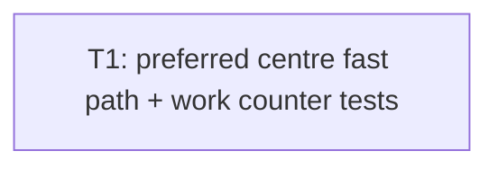

# Plan: audit issue #8 preferred placement fast path

## Goal

`nearest_free_body_center` early-return exact preferred cell centre when legal/free/unique optimum (dist 0). Exhaustive fallback + ties unchanged. Deterministic work counter proves no full map scan on hit. Success = unit tests green + production spawn regression green. No wall-clock gate.

## Scope

- In: `crates/mmd-engine/src/rts/world.rs` fn `nearest_free_body_center` fast path; `#[cfg(test)]` visit counter; focused unit tests in `world.rs` `tests` mod; keep existing connectivity/illegal-anchor tests green; regression `a_produced_unit_spawns_beside_its_building`.
- Out: F10 shipping overlap repair; broad nav redesign; perf-number / wall-clock gates; `anchor_component` rewrite; public API change; call-site changes (seed/production/evac/repair).

## Assumptions

- Caller autonomous Markdown-only → no grill, no HTML plan, no ADR, no architecture HTML.
- Fast path **before** `anchor_component` + exhaustive loop. Hit → skip both.
- Exact centre equality via `preferred == [floor(p)+0.5, floor(p)+0.5]` + non-neg floor + in-bounds cell. No clamp on fast path.
- Legal preferred cell → own anchor component always (`component_at(cell).is_some()`). No separate anchor compare on fast path.
- `dist2(preferred, preferred) == 0` + unique cell centres on maps ≤512 → unique optimum. Tie rule irrelevant on hit.
- Return **reconstructed** `[x as f32 + 0.5, y as f32 + 0.5]`, never raw `preferred` bits.
- Work proof = `#[cfg(test)]` counter ++ once per exhaustive `(x,y)` loop iteration only. Fast path → 0. Fallback → `width * height`. No bench numbers.
- One ticket = one green commit slice.

## Ticket flowchart

## Ticket order

| ID | Title | Depends | Commit outcome | File |
| --- | --- | --- | --- | --- |
| T1 | Preferred centre fast path | — | Exact free preferred returns O(bodies) with 0 cell visits; fallback/ties/output preserved | `PLAN_2026_08_14_audit_issue_8_preferred_placement_fast_path/T1_preferred_centre_fast_path.md` |

## Tickets

- [T1: Preferred centre fast path](PLAN_2026_08_14_audit_issue_8_preferred_placement_fast_path/T1_preferred_centre_fast_path.md) — depends: none
