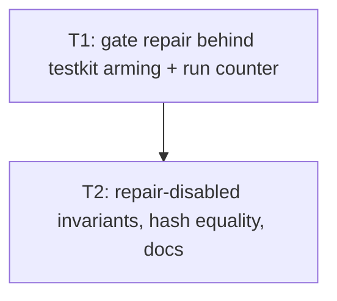

# Plan: audit issue #9 shipping overlap repair

## Goal

`RtsWorld::movement` runs `repair_body_overlaps` — an N×N penetration search — on **every** shipping tick, although nothing in the game can produce a penetration: only the two testkit hooks (`force_position_for_test`, `entities_mut`) can. Gate the pass out of the shipping tick path, keep forced-overlap repair working under `testkit`, and prove with deterministic work counts (never timings) that the normal seed/movement/production/build paths need no repair. Success = repair compiled out of the no-testkit build, `overlap_repair_runs() == 0` over normal runs, a repair-armed run and a repair-disabled run hashing identically, the canonical collision hash still `7e40af444dc7010a1b910c3e852fad8f4ffa76f0d108004043b94d27504f6b8e`, and the shipping feature graph still free of `testkit`.

Every test command below states the `running N tests` line and the pass/ignore counts it must print: a bare short name with `--exact` that no longer resolves matches **0** tests and still exits 0, which would read as a pass.

## Scope

- In: `crates/mmd-engine/src/rts/world.rs` (`movement`, `repair_body_overlaps`, `entities_mut`, `force_position_for_test`, two `#[cfg(feature = "testkit")]` fields, one `#[cfg(feature = "testkit")]` accessor); new/edited tests in `crates/mmd-engine/tests/rts_collision.rs`, `rts_production.rs`, `rts_build.rs`; ADR 017 amendment; phase-1.1 close-doc coverage rows.
- Out: F9 preferred-centre fast path (landed at `af728fe`, do not revert); collision/push/deflection redesign; the per-arrival `body_penetrates_any` call in `step_one_unit` (`world.rs:2536` — shipping path, stays); horde sim; any wall-clock/perf-number gate; merge-gate command list in `docs/05-testing.md` / `README.md`; removing or renaming any existing public API or test.

## Assumptions

- Caller autonomous, Markdown-only → no grill, no HTML plan, no new ADR file, no architecture HTML. ADR 017 gets an amendment section, which is this repo's landed convention (`6bf6e9a` amended it the same way).
- **Gating mechanism is locked: `#[cfg(feature = "testkit")]` *plus* a testkit-only armed flag.** `cfg` alone cannot satisfy "prove the normal paths hold with repair disabled", because every integration test binary compiles with `testkit` on and would keep the pass live. The flag alone would leave a per-tick branch and the whole pass compiled into the shipping binary. Both together: shipping compiles no repair code at all, and a testkit run repairs only after a hook armed it.
- Arming happens in **both** testkit hooks — `force_position_for_test` and `entities_mut` — because those are exactly the two mutations the code already documents as able to produce a penetration. Arming on `entities_mut` (a raw `&mut EntityStore`, whose later writes cannot be observed) is the conservative choice that reproduces today's behaviour for every existing raw-mutation test.
- Arming is **sticky until repair succeeds**: the flag clears only on a pass that ends with `last_tick_error == None`. That preserves today's "an unrepairable overlap is re-reported every tick" semantics exactly.
- `last_tick_error` is reset to `None` at the top of `movement()` unconditionally (moved out of `repair_body_overlaps`), so its documented meaning — "describes the last tick, never an older one" — survives in a build where the repair pass does not exist. In shipping it is therefore always `None`.
- Neither new field enters `state_hash` (`world.rs:2695`), so no valid-state hash moves.
- `body_penetrates_any` is **not** `cfg`-gated: `step_one_unit` calls it on the shipping arrival check (`world.rs:2536`).
- Work/observability proof is a deterministic counter of executed repair passes (`overlap_repair_runs()`), never a timing.
- Feature-graph proof stays the documented shell check plus a no-testkit lib build and clippy run; it is not turned into a `cargo`-in-a-test.
- Two commit-sized slices: T1 lands the mechanism and keeps forced-overlap coverage green; T2 lands the repair-disabled invariants, the hash-equality proof and the docs.

## Ticket flowchart

## Ticket order

| ID | Title | Depends | Commit outcome | File |
| --- | --- | --- | --- | --- |
| T1 | Gate repair behind testkit arming | — | Shipping tick compiles no overlap-repair pass; testkit repairs only after a hook armed it; forced-overlap and unrepairable-overlap coverage green | `PLAN_2026_08_14_audit_issue_9_shipping_overlap_repair/T1_gate-repair-behind-testkit-arming.md` |
| T2 | Repair-disabled invariants and hash equality | T1 | Seed/movement/production/build runs prove 0 repair passes and 0 overlaps; armed vs disabled runs hash identically; ADR 017 + close doc match the code | `PLAN_2026_08_14_audit_issue_9_shipping_overlap_repair/T2_repair-disabled-invariants-and-hash-equality.md` |

## Tickets

- [T1: Gate repair behind testkit arming](PLAN_2026_08_14_audit_issue_9_shipping_overlap_repair/T1_gate-repair-behind-testkit-arming.md) — depends: none
- [T2: Repair-disabled invariants and hash equality](PLAN_2026_08_14_audit_issue_9_shipping_overlap_repair/T2_repair-disabled-invariants-and-hash-equality.md) — depends: T1
