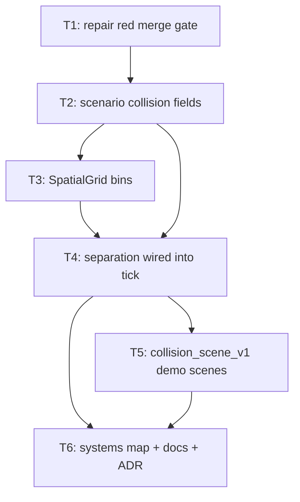

# Plan: Zombie Collision (agent separation)

## Goal

Zombies stop passing through each other. Add agent-agent **soft separation
steering** to the fixed-tick simulation: a repulsion vector summed into the
flow-field vector before the single move, driven by a per-scenario body radius.
Success = every shipped scenario carries collision data, the sim consumes it on
every tick, a released stack of coincident agents demonstrably spreads, the
merge gate is green, and two new tracked scenes make the effect visible at
sprite scale.

## Scope

- In:
  - Scenario contract gains `collision_radius_q8` + `separation_strength_q8` (Q8 fixed point, 256 = 1 cell / 1.0).
  - New `SpatialGrid` (prealloc counting-sort bins, zero per-tick allocation).
  - Separation pass wired into `sim::tick::step` — **always on**, radius comes from scenario data.
  - Deterministic tie-break for exactly-coincident agents (127 spawn cells hold ~394 stacked agents at tick 0).
  - Re-derivation of the two behavioural contracts that assumed no agent-agent forces.
  - Two new tracked scenes (`collision_scene_v1` family): 10k mid-radius, 1 200 sprite-accurate.
  - Repair of the **already-red** merge gate (`docs/02-prototype-roadmap.md` was deleted; `tests/validation_contract.rs` still reads it).
  - Docs: systems map, close doc, ADR 009, architecture HTML, glossary.
- Out:
  - Hard non-overlap guarantee. Soft steering was chosen; overlap is bounded statistically, never forbidden. No test may claim zero overlap.
  - Renderer changes. Sprite size, atlas, shaders, goldens untouched (the golden scene is `SpriteRenderer::static_demo_groups`, independent of sim state).
  - Any performance number. Perf gating is retired (`docs/05-testing.md`); no doc or test may state a speed figure.
  - Agent-obstacle collision (already exists via `position_walkable`).
  - New CLI flags. Collision is scenario data, not a runtime switch.
  - Combat, damage, unit stats, selection, camera.

## Assumptions

- **A1** — "Collision between zombie sprites" cannot hold literally at 50 000 agents. Screen is 1920×1080 = 2 073 600 px; a sprite is 30×30 = 900 px; 50 000 sprites = 45 000 000 px = 22× the screen. Hex-packed 30 px discs on the free 80% of that screen: ~1 700 max. User chose "radius is scenario data, ship all three tunings" — so the gate scene gets a sub-sprite body radius and the sprite-accurate look lives in a low-count scene.
- **A2** — Tunings: gate scene `technical_prototype_v1` r = 102 q8 (0.398 cell ≈ 1.6 px); tracked fixtures r = 32 q8 (0.125 cell) so 1-cell corridors keep their throughput and `agents_reach_destination` keeps its 90% claim; `collision_mid_v1` r = 320 q8 (1.25 cells) at 10 000 agents; `collision_sprite_v1` r = 960 q8 (3.75 cells = 15 px = half a sprite) at 1 200 agents. Separation strength 256 q8 (= 1.0) everywhere.
- **A3** — Fields are `u32` Q8 fixed point, not `f32`, because `Scenario` and `ScenarioSpec` both derive `Eq`. `q as f32 / 256.0` is exact (power-of-two divisor).
- **A4** — Inline `GridSpec` harness grids default to radius 0 (collision inert), so every surgical unit-scale test in `simulation.rs` stays bit-identical. Only the tracked fixtures and the gate scene flip behaviour.
- **A5** — Radius 0 is a legal scenario value meaning "no body". The separation *code path* is always on; a zero radius makes it a no-op. That is what makes "flow-only equals collision-off" testable.
- **A6** — Jam at the destination funnel is accepted as real behaviour (user's choice). The monotone-progress contract is re-derived as a bounded-stall contract, not deleted.
- **A7** — Existing scenario `.ron` files are edited in place and their `.sha256` sidecars regenerated. The new fields are **required** (no `serde(default)`), so a drifted or stale scenario fails loudly instead of silently running without collision.
- **A8** — No scenario generator exists in-tree today (fixtures and the gate scene are tracked assets). The two new scenes ship the same way, with their generator committed at `tools/scenegen/gen_collision_scenes.py` for provenance. No new `--check` gate.
- **A9** — `graphify` is documented in `AGENT.md` but the CLI is not installed on this host (`graphify: command not found`). Tickets therefore do not run `graphify update .`; see T1 for the user-facing note.
- **A10** — Artifacts go to `artifacts/` (the directory that exists and is documented in `AGENT.md`), not the skill's default `artifacts/`.

## Ticket flowchart

## Ticket order

| ID  | Title | Depends | Commit outcome | File |
| --- | ----- | ------- | -------------- | ---- |
| T1 | Repair the red merge gate | — | `cargo test --workspace` is green again before any feature work | `PLAN_2026_08_08_zombie-collision/T1_repair-red-merge-gate.md` |
| T2 | Scenario collision contract | T1 | Every scenario carries a body radius + separation strength; behaviour unchanged | `PLAN_2026_08_08_zombie-collision/T2_scenario-collision-contract.md` |
| T3 | SpatialGrid neighbour bins | T2 | Zero-alloc deterministic uniform-grid neighbour lookup exists and is tested; unused | `PLAN_2026_08_08_zombie-collision/T3_spatial-grid.md` |
| T4 | Separation wired into the tick | T3 | Zombies push apart every tick on every tracked scenario; contracts re-derived | `PLAN_2026_08_08_zombie-collision/T4_separation-in-tick.md` |
| T5 | `collision_scene_v1` demo scenes | T4 | Two runnable scenes: 10k mid-body and 1 200 sprite-accurate non-overlapping | `PLAN_2026_08_08_zombie-collision/T5_collision-demo-scenes.md` |
| T6 | Systems map, docs, ADR | T5 | Collision is a named phase-0 system with an enforced test map and a written record | `PLAN_2026_08_08_zombie-collision/T6_systems-map-and-docs.md` |

## Tickets

- [T1: Repair the red merge gate](PLAN_2026_08_08_zombie-collision/T1_repair-red-merge-gate.md) — depends: none
- [T2: Scenario collision contract](PLAN_2026_08_08_zombie-collision/T2_scenario-collision-contract.md) — depends: T1
- [T3: SpatialGrid neighbour bins](PLAN_2026_08_08_zombie-collision/T3_spatial-grid.md) — depends: T2
- [T4: Separation wired into the tick](PLAN_2026_08_08_zombie-collision/T4_separation-in-tick.md) — depends: T3
- [T5: `collision_scene_v1` demo scenes](PLAN_2026_08_08_zombie-collision/T5_collision-demo-scenes.md) — depends: T4
- [T6: Systems map, docs, ADR](PLAN_2026_08_08_zombie-collision/T6_systems-map-and-docs.md) — depends: T5

## Records produced alongside this plan

- [ADR 009 — Agent separation and collision](../docs/ADR/009_ADR_agent_separation_and_collision.md)
- [Agent collision architecture (HTML)](../docs/agent-collision-architecture.html)
