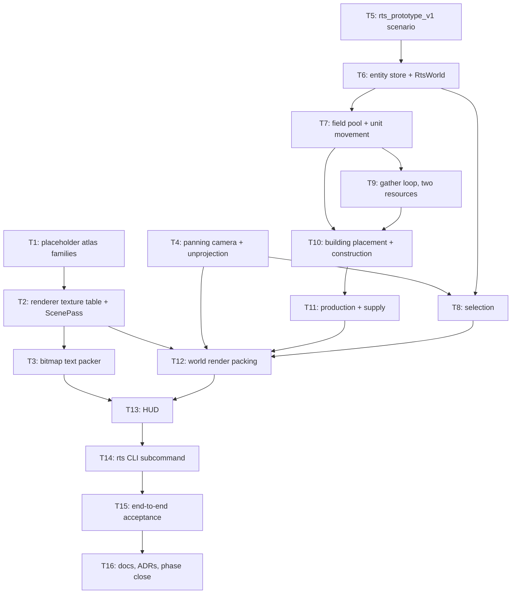

# Plan: RTS Engine Prototype (Phase 1)

## Goal

Prove custom engine run real-time-strategy mechanics, not just horde walk.
Thin vertical slice through all six phase-1 systems — camera, selection,
workers, economy, building, unit production — on a new horde-free scene.

**Success** = `cargo run -- rts --frames 3000 --inject-input <acceptance script>`
exits 0 having: panned camera, box-selected workers, gathered both resources,
placed + finished a Depot and a Barracks, produced a Soldier bounded by supply.
Every step asserted headlessly and deterministically. Whole phase-0 merge gate
stays green, phase-0 render golden byte-unchanged.

## Scope

- **In**
  - Pan + edge-pan camera, clamped to map. `IsoView` origin becomes movable.
  - Screen→cell unprojection. Mouse input (click, drag-box, right-click).
  - Entity store (SoA, generational ids, preallocated) for units + buildings + nodes.
  - Selection: click, additive click, drag rectangle, selection cap.
  - Workers: move, gather Crystal, gather Gas, haul to drop-off, build.
  - Economy: two resources + supply (used/cap).
  - Buildings: HQ, Depot, Barracks. Grid placement, footprint validity, ghost,
    construction progress, cancel refund.
  - Unit production: HQ→Worker, Barracks→Soldier. Queue cap 5. Rally point.
  - Flow-field pool (8 slots, LRU) for player-unit movement.
  - Second atlas family + bitmap-font HUD layer, both procedurally generated
    and hash-tracked by `xtask atlases --check`.
  - New `rts` CLI subcommand with scripted headless input.
  - ADR 013 / 014 / 015, one architecture page, doc index + testing-gate update.

- **Out**
  - Combat, weapons, damage, health, enemy AI (phase 2).
  - Zombie horde in the RTS scene (horde-free by construction; the phase-0 gate
    scene keeps running untouched).
  - Zoom. Minimap. Fog of war. Save/load. Menus. Sound.
  - Performance numbers of any kind — `no_perf_claim_in_docs` still binds.
  - Second player / factions / AI opponent.
  - Real art. Every phase-1 sprite is a deterministic placeholder.
  - Cross-platform verification. Linux/Vulkan dev host only, as phase 0.

## Assumptions

- `artifacts/` (hyphen) is the repo's artefact dir; the skill's `artifacts`
  spelling is not what this repo uses. Repo convention wins.
- Phase-0 contracts stay frozen: `MAX_LIVE_AGENTS = 5_000`, `SpriteInstance` at
  48 bytes, `atlas_count/direction_count/frame_count = 4/8/4` for every scenario
  family, `testkit` feature-gated out of the shipping binary, no GitHub Actions.
- New `ScenarioSpec` fields are `#[serde(default)]` so every tracked `.ron` keeps
  its exact bytes and its `.sha256` sidecar stays valid. No phase-0 asset is
  regenerated by this plan.
- `run` and its 24 CLI-contract cases are not touched. RTS ships as a **new**
  `rts` subcommand with its own script parser and its own stdout contract.
- `InputAction` / `BoundKey` are not extended. RTS input is a separate
  `RtsCommand` enum, so `input_actions_are_stable` cannot be perturbed.
- The phase-0 render golden must stay byte-identical: the new scene pass draws
  world groups then overlay in exactly the phase-0 order when the UI layer is
  empty.
- Determinism is same-host, same-binary, as phase 0. `f32` is not claimed
  bit-identical across builds.
- Placeholder art is generated from code with no external source image, so it
  carries no third-party licence obligation; `assets/sprites/source/` is
  untouched.
- Every ticket is mutation-verified in both directions, matching the standard
  T30–T33 and T0–T10 set.
- Zero-allocation invariant is restated, not weakened: the movement, systems and
  pack portion of an RTS tick allocates nothing after warmup. A flow-field
  *miss* rebuilds into reused scratch and may grow that scratch once; this is
  documented and tested as the single bounded exception.

## Ticket flowchart

## Ticket order

| ID  | Title                              | Depends       | Commit outcome                                                                 | File                                                                        |
| --- | ---------------------------------- | ------------- | ------------------------------------------------------------------------------ | --------------------------------------------------------------------------- |
| T1  | Placeholder atlas families         | —             | `xtask atlases --check` covers two new tracked families: `rts/` and `ui/`.       | `PLAN_2026_08_10_rts-engine-prototype/T1_placeholder-atlas-families.md`     |
| T2  | Renderer texture table + ScenePass | T1            | Renderer draws any of 9 texture slots through a world/overlay/ui scene pass.     | `PLAN_2026_08_10_rts-engine-prototype/T2_texture-table-and-scene-pass.md`   |
| T3  | Bitmap text packer                 | T2            | `render::text::push_text` turns a `&str` into UI sprite instances.               | `PLAN_2026_08_10_rts-engine-prototype/T3_bitmap-text-packer.md`             |
| T4  | Panning camera + unprojection      | —             | Camera pans and clamps; a screen pixel resolves back to a map cell.              | `PLAN_2026_08_10_rts-engine-prototype/T4_camera-and-unprojection.md`        |
| T5  | `rts_prototype_v1` scenario        | —             | A horde-free RTS scene loads, hash-verified, with nodes and an HQ site.          | `PLAN_2026_08_10_rts-engine-prototype/T5_rts-scenario-family.md`            |
| T6  | Entity store + `RtsWorld`          | T5            | Entities spawn/despawn with stable ids; `RtsWorld::tick` advances.               | `PLAN_2026_08_10_rts-engine-prototype/T6_entity-store-and-world.md`         |
| T7  | Field pool + unit movement         | T6            | A move order routes units over a pooled flow field and they arrive.              | `PLAN_2026_08_10_rts-engine-prototype/T7_field-pool-and-movement.md`        |
| T8  | Selection                          | T4, T6        | Click and drag-box select units; the set is queryable.                           | `PLAN_2026_08_10_rts-engine-prototype/T8_selection.md`                      |
| T9  | Gather loop, two resources         | T7            | Workers mine Crystal and Gas, haul, and the totals rise.                         | `PLAN_2026_08_10_rts-engine-prototype/T9_gather-loop.md`                    |
| T10 | Building placement + construction  | T7, T9        | A worker places a Depot on the grid and it finishes building.                    | `PLAN_2026_08_10_rts-engine-prototype/T10_building-placement.md`            |
| T11 | Production + supply                | T10           | HQ makes Workers, Barracks makes Soldiers, supply blocks over-cap.               | `PLAN_2026_08_10_rts-engine-prototype/T11_production-and-supply.md`         |
| T12 | World render packing               | T2, T4, T8, T11 | The RTS world packs into draw groups and an overlay.                           | `PLAN_2026_08_10_rts-engine-prototype/T12_world-render-packing.md`          |
| T13 | HUD                                | T3, T12       | Resources, supply, selection and the build menu are drawn on screen.             | `PLAN_2026_08_10_rts-engine-prototype/T13_hud.md`                           |
| T14 | `rts` CLI subcommand               | T13           | `cargo run -- rts` runs the scene with scripted mouse and key input.             | `PLAN_2026_08_10_rts-engine-prototype/T14_rts-cli-subcommand.md`            |
| T15 | End-to-end acceptance              | T14           | One scripted run drives the whole economy loop and asserts it.                   | `PLAN_2026_08_10_rts-engine-prototype/T15_end-to-end-acceptance.md`         |
| T16 | Docs, ADRs, phase close            | T15           | Phase 1 is recorded, gated and indexed; every claim is falsifiable.              | `PLAN_2026_08_10_rts-engine-prototype/T16_docs-and-phase-close.md`          |

## Tickets

- [T1: Placeholder atlas families](PLAN_2026_08_10_rts-engine-prototype/T1_placeholder-atlas-families.md) — depends: none
- [T2: Renderer texture table + ScenePass](PLAN_2026_08_10_rts-engine-prototype/T2_texture-table-and-scene-pass.md) — depends: T1
- [T3: Bitmap text packer](PLAN_2026_08_10_rts-engine-prototype/T3_bitmap-text-packer.md) — depends: T2
- [T4: Panning camera + unprojection](PLAN_2026_08_10_rts-engine-prototype/T4_camera-and-unprojection.md) — depends: none
- [T5: `rts_prototype_v1` scenario](PLAN_2026_08_10_rts-engine-prototype/T5_rts-scenario-family.md) — depends: none
- [T6: Entity store + `RtsWorld`](PLAN_2026_08_10_rts-engine-prototype/T6_entity-store-and-world.md) — depends: T5
- [T7: Field pool + unit movement](PLAN_2026_08_10_rts-engine-prototype/T7_field-pool-and-movement.md) — depends: T6
- [T8: Selection](PLAN_2026_08_10_rts-engine-prototype/T8_selection.md) — depends: T4, T6
- [T9: Gather loop, two resources](PLAN_2026_08_10_rts-engine-prototype/T9_gather-loop.md) — depends: T7
- [T10: Building placement + construction](PLAN_2026_08_10_rts-engine-prototype/T10_building-placement.md) — depends: T7, T9
- [T11: Production + supply](PLAN_2026_08_10_rts-engine-prototype/T11_production-and-supply.md) — depends: T10
- [T12: World render packing](PLAN_2026_08_10_rts-engine-prototype/T12_world-render-packing.md) — depends: T2, T4, T8, T11
- [T13: HUD](PLAN_2026_08_10_rts-engine-prototype/T13_hud.md) — depends: T3, T12
- [T14: `rts` CLI subcommand](PLAN_2026_08_10_rts-engine-prototype/T14_rts-cli-subcommand.md) — depends: T13
- [T15: End-to-end acceptance](PLAN_2026_08_10_rts-engine-prototype/T15_end-to-end-acceptance.md) — depends: T14
- [T16: Docs, ADRs, phase close](PLAN_2026_08_10_rts-engine-prototype/T16_docs-and-phase-close.md) — depends: T15

## Decisions recorded

- [ADR 013 — Phase-1 scope and the RTS entity model](../docs/ADR/013_ADR_phase1_scope_and_rts_entity_model.md)
- [ADR 014 — Movable camera, texture table and the UI layer](../docs/ADR/014_ADR_movable_camera_texture_table_and_ui_layer.md)
- [ADR 015 — Economy, construction and production determinism](../docs/ADR/015_ADR_economy_construction_and_production_determinism.md)
- [RTS engine prototype architecture](../docs/rts-engine-prototype-architecture.html)
