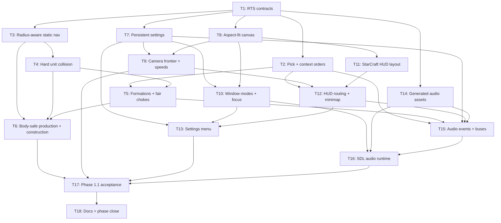

# Plan: RTS interaction, UI, and audio hardening

## Goal

Ship phase 1.1 as one deterministic RTS vertical slice: manual clicks match visible geometry, RTS bodies never overlap, camera/window/settings/HUD/minimap work like RTS controls, generated placeholder audio confirms selection/orders/UI. Success = full merge gate green; live-equivalent 1,600-frame script proves whole loop; phase-0 horde/hash/golden contracts unchanged.

## Scope

- In: RTS pick geometry; mixed resource context orders; 3-cell hard RTS bodies; radius-aware nav; formations; 30/24 cell/s RTS speeds; 512×512 RTS map cap; persisted settings; 3 window modes; pointer confinement; aspect-fit canvas; camera frontier; StarCraft-like bottom HUD; minimap click; menu/settings; generated WAV music/cues; deterministic acceptance/docs.
- Out: horde `sim/` behavior; combat; enemy AI impl; zoom; fog/minimap entities; dynamic render target; copyrighted StarCraft audio; perf gates; hosted CI.

## Assumptions

- Confirmed decisions: `../artifacts/GRILL_2026_08_10_rts-feedback/ANSWERS.md`.
- Plan artifacts use requested `artifacts/`; existing repo agent artifacts remain in `artifacts/`.
- Unfinished sites stay walkable. Impossible evacuation stalls completion at final pre-complete tick.
- RTS body radius lives on `UnitKind`; horde `Scenario::collision_radius_q8` does not define player body.
- Formation uses one pooled anchor field per group + bounded straight-line terminal slot steering. No per-unit A* or per-unit flow field.
- Interactive audio failure returns exit 1. Offscreen/headless mode uses fake sink; never opens physical audio or user config.
- Proposed ADRs 016–020 become Accepted only in T18 after matching behavior lands.

## Ticket flowchart

## Ticket order

| ID | Title | Depends | Commit outcome | File |
| --- | --- | --- | --- | --- |
| T1 | Lock phase-1.1 RTS contracts | — | Map/body/speed contracts compile; tracked scene stays 320×320 | `PLAN_2026_08_10_rts-interaction-ui-audio-hardening/T1_rts-contracts.md` |
| T2 | Unify pick geometry and context orders | T1 | Visible resource/unit pixels drive same live/headless context path | `PLAN_2026_08_10_rts-interaction-ui-audio-hardening/T2_picking-and-context-orders.md` |
| T3 | Add radius-aware static navigation | T1 | 3-cell bodies clear solids/edges; interaction targets remain reachable | `PLAN_2026_08_10_rts-interaction-ui-audio-hardening/T3_radius-aware-static-navigation.md` |
| T4 | Enforce hard RTS unit collision | T3 | Every RTS unit ends every tick non-overlapping; deterministic; allocation-free | `PLAN_2026_08_10_rts-interaction-ui-audio-hardening/T4_hard-unit-collision.md` |
| T5 | Add formations and fair choke queues | T2, T4 | Group orders end at distinct slots through one pooled anchor field | `PLAN_2026_08_10_rts-interaction-ui-audio-hardening/T5_formations-and-fair-chokes.md` |
| T6 | Make production and construction body-safe | T3, T4, T5 | Spawns/completions never create overlap; blocked transitions wait | `PLAN_2026_08_10_rts-interaction-ui-audio-hardening/T6_body-safe-production-and-construction.md` |
| T7 | Add persistent validated settings | T1 | Versioned per-user settings round-trip; offscreen runs stay isolated | `PLAN_2026_08_10_rts-interaction-ui-audio-hardening/T7_persistent-settings.md` |
| T8 | Add aspect-fit logical canvas | T1 | 1920×1080 content letterboxes without distortion; input inverse matches | `PLAN_2026_08_10_rts-interaction-ui-audio-hardening/T8_aspect-fit-canvas.md` |
| T9 | Add camera frontier and split speeds | T7, T8 | Camera cannot cross projected frontier; keyboard/edge speeds differ | `PLAN_2026_08_10_rts-interaction-ui-audio-hardening/T9_camera-frontier-and-speeds.md` |
| T10 | Wire window modes, focus, pointer confinement | T7, T8 | Borderless/exclusive/windowed modes + focus lifecycle work | `PLAN_2026_08_10_rts-interaction-ui-audio-hardening/T10_window-modes-and-focus.md` |
| T11 | Rebuild StarCraft-like HUD layout | T8 | Left minimap, center selection, right 3×3 command card render | `PLAN_2026_08_10_rts-interaction-ui-audio-hardening/T11_starcraft-hud-layout.md` |
| T12 | Route HUD input and minimap camera | T2, T9, T11 | HUD consumes clicks; icons/cards/minimap execute shared actions | `PLAN_2026_08_10_rts-interaction-ui-audio-hardening/T12_hud-routing-and-minimap.md` |
| T13 | Add gear menu and settings panel | T7, T10, T12 | Nested paused menu edits/saves/applies settings immediately | `PLAN_2026_08_10_rts-interaction-ui-audio-hardening/T13_settings-menu.md` |
| T14 | Generate tracked placeholder audio | T1 | Deterministic WAVs + manifest regenerate byte-identically | `PLAN_2026_08_10_rts-interaction-ui-audio-hardening/T14_generated-audio-assets.md` |
| T15 | Emit deterministic audio events and buses | T2, T5, T7, T12, T14 | Fake sink proves music/voice/reject/UI events + gains | `PLAN_2026_08_10_rts-interaction-ui-audio-hardening/T15_audio-events-and-buses.md` |
| T16 | Add SDL audio runtime | T10, T14, T15 | Interactive window plays loop/cues; audio failure aborts; offscreen skips device | `PLAN_2026_08_10_rts-interaction-ui-audio-hardening/T16_sdl-audio-runtime.md` |
| T17 | Prove phase 1.1 end to end | T6, T9, T13, T16 | 1,600-frame live-equivalent script proves complete feedback loop | `PLAN_2026_08_10_rts-interaction-ui-audio-hardening/T17_phase1-1-acceptance.md` |
| T18 | Close docs and run merge gate | T17 | ADRs/docs/test map match landed behavior; full gate green | `PLAN_2026_08_10_rts-interaction-ui-audio-hardening/T18_docs-and-phase-close.md` |

## Tickets

- [T1: Lock phase-1.1 RTS contracts](PLAN_2026_08_10_rts-interaction-ui-audio-hardening/T1_rts-contracts.md) — depends: none
- [T2: Unify pick geometry and context orders](PLAN_2026_08_10_rts-interaction-ui-audio-hardening/T2_picking-and-context-orders.md) — depends: T1
- [T3: Add radius-aware static navigation](PLAN_2026_08_10_rts-interaction-ui-audio-hardening/T3_radius-aware-static-navigation.md) — depends: T1
- [T4: Enforce hard RTS unit collision](PLAN_2026_08_10_rts-interaction-ui-audio-hardening/T4_hard-unit-collision.md) — depends: T3
- [T5: Add formations and fair choke queues](PLAN_2026_08_10_rts-interaction-ui-audio-hardening/T5_formations-and-fair-chokes.md) — depends: T2, T4
- [T6: Make production and construction body-safe](PLAN_2026_08_10_rts-interaction-ui-audio-hardening/T6_body-safe-production-and-construction.md) — depends: T3, T4, T5
- [T7: Add persistent validated settings](PLAN_2026_08_10_rts-interaction-ui-audio-hardening/T7_persistent-settings.md) — depends: T1
- [T8: Add aspect-fit logical canvas](PLAN_2026_08_10_rts-interaction-ui-audio-hardening/T8_aspect-fit-canvas.md) — depends: T1
- [T9: Add camera frontier and split speeds](PLAN_2026_08_10_rts-interaction-ui-audio-hardening/T9_camera-frontier-and-speeds.md) — depends: T7, T8
- [T10: Wire window modes, focus, pointer confinement](PLAN_2026_08_10_rts-interaction-ui-audio-hardening/T10_window-modes-and-focus.md) — depends: T7, T8
- [T11: Rebuild StarCraft-like HUD layout](PLAN_2026_08_10_rts-interaction-ui-audio-hardening/T11_starcraft-hud-layout.md) — depends: T8
- [T12: Route HUD input and minimap camera](PLAN_2026_08_10_rts-interaction-ui-audio-hardening/T12_hud-routing-and-minimap.md) — depends: T2, T9, T11
- [T13: Add gear menu and settings panel](PLAN_2026_08_10_rts-interaction-ui-audio-hardening/T13_settings-menu.md) — depends: T7, T10, T12
- [T14: Generate tracked placeholder audio](PLAN_2026_08_10_rts-interaction-ui-audio-hardening/T14_generated-audio-assets.md) — depends: T1
- [T15: Emit deterministic audio events and buses](PLAN_2026_08_10_rts-interaction-ui-audio-hardening/T15_audio-events-and-buses.md) — depends: T2, T5, T7, T12, T14
- [T16: Add SDL audio runtime](PLAN_2026_08_10_rts-interaction-ui-audio-hardening/T16_sdl-audio-runtime.md) — depends: T10, T14, T15
- [T17: Prove phase 1.1 end to end](PLAN_2026_08_10_rts-interaction-ui-audio-hardening/T17_phase1-1-acceptance.md) — depends: T6, T9, T13, T16
- [T18: Close docs and run merge gate](PLAN_2026_08_10_rts-interaction-ui-audio-hardening/T18_docs-and-phase-close.md) — depends: T17
