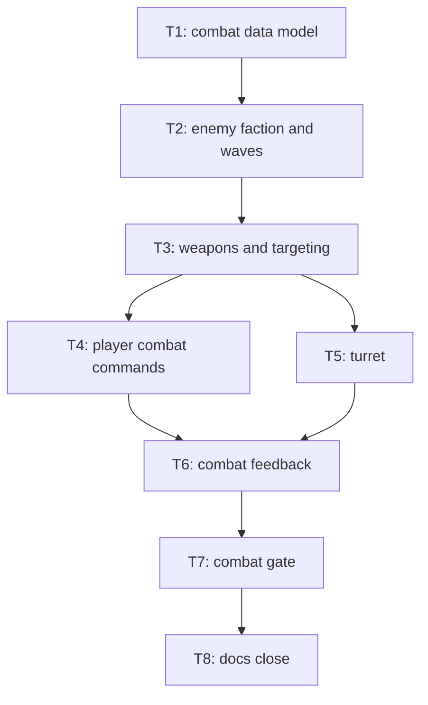

# Plan: combat-prototype

## Goal

Phase 2 Combat Prototype: weapons, damage, turrets, enemy AI on existing RTS world.
Success = new tracked combat script drives spawn → march → fight → deaths end-to-end through shipped binary, exit line carries combat tokens, full merge gate green.

## Scope

- In: HP/armor/damage model, death (units + buildings incl. HQ), enemy faction (`OWNER_ENEMY`), melee enemy kind, scenario waves + spawn points (hundreds scale, 300–800 total), march-on-HQ AI, soldier auto-acquire, Attack/AttackMove/Stop commands, `BuildingKind::Turret`, HP bars, minimap enemy dots, new gate script + exit tokens, one-time re-baseline of both phase-1 scripts + scene sha256, close docs.
- Out: horde-scale enemies (phase 3), walls/waves-design (phase 4), balance (phase 5), missions/win-lose framework (phase 6), zoom, fog of war, save/load, perf claims, ranged enemy kind, worker attack, projectile entities, damage types.

## Assumptions

- `OWNER_ENEMY = 1`. Enemies: no supply, no cost, never gather/build/produce.
- Enemy kind name: `UnitKind::Ghoul`, body radius 3.0 (shared), speed 18 c/s.
- Stats = placeholders (balance out of scope): Worker 25 HP/0 armor unarmed; Soldier 40/0, dmg 6, cd 15 ticks, range 24; Ghoul 30/0, dmg 5, cd 30, range 8; Turret 150/1, dmg 10, cd 20, range 36, footprint 6, cost 75 crystal, no supply; HQ 400/2; Depot 150/1; Barracks 200/1.
- Damage per hit = `max(1, damage - armor)`. Instant-hit, no projectile entity.
- Enemy march = permanent `Order::AttackMove` at HQ anchor — one code path with player A-move. HQ dead → retarget nearest remaining player building (lowest-slot tie-break); none → Idle.
- Target pick = nearest in weapon range, lowest-slot tie-break. Deaths resolve in combat system; selection prune already last in tick.
- Combat system inserts between orders and movement in pinned tick order. Wave spawner runs early (after camera).
- Building death: production queue cancels, no refund; supply recount self-heals. HQ death → gather orders → Idle.
- Attack accept reuses `voice_order` receipt. No new voice bus.
- Enemy click-selectable (read-only card: kind + HP); drag box selects player-only.
- HP bar = texture-free overlay line instances, damaged + selected only, buildings same rule.
- Waves: finite scenario list; spawn deferred (bounded) if store full; validator caps total enemies ≤ 1200 so player 500 + buildings + nodes fit `MAX_ENTITIES = 2048`.
- Re-baseline of phase-1 scripts + `rts_prototype_v1.sha256` happens atomically in T7, same commit as scene change.
- No user interaction needed (no packages/accounts/keys) → T1 frontloads nothing.

Detail-pass amendments (codebase-forced, folded into ticket files):

- Armor = kind table (pure fn of kind), not a store column; only HP is a column (u32). `DamageResult` = `Damaged | Killed | Indestructible | NoTarget`. Building death revokes its supply grant via existing `Supply::revoke_cap`; HQ death also clears `start_hq`.
- Combat-gate fixture keeps filename `fixture_rts_combat_v1.ron` but carries `version: "rts_prototype_v1"` (validator requires the `rts:` block iff that version) and stays out of `ALL_FIXTURES`. Ghoul arms: `supply_cost`=0, `unit_speed` 18.0, `unit_cost`/`produce_ticks` = `unreachable!` (never produced). `enemies_spawned` counter NOT in state hash.
- Enemy objective = **approach cell** of nearest player building, not the HQ anchor cell (pooled field to a blocked footprint cell fails). Kill/loss counters hashed into `state_hash`. Combat→movement halt via `combat_hold` channel.
- T4 needs **zero new script tokens** (`key:a` = `ExecuteSlot(3)` exists): Attack = card slot 3 (A), Stop = slot 4 (S); attack family voices as `VoiceCue::Move`; two new command icons enter the xtask-generated props sheet (regen commit).
- Building costs live in `build.rs`; `TURRET_BUILD_TICKS = 180` (== `DEPOT_BUILD_TICKS`); turret button = build-menu slot 3, key A; turret fire silent + unanimated → named gap in close doc.
- Bar/flash assembly lives in `rts/pack.rs` (not `rts_run.rs`); minimap palette gains an unclaimed red.
- **Gate-scene deviation (approved):** `pre_placed: []` — waves only. Proof: any pre-placed Ghoul reaches the base by ~tick 810 and kills the HQ inside the old scripts' windows, gutting un-re-baselineable phase-1 pins. Waves: 400 total (spawn points SW (14,304) / SE (306,304); 12 @ tick 3000 fighting wave + 150/150/88 @ 4100/4160/4220), first contact ≈ tick 3480–3650, hordes spawned-not-fought. Both old scripts' asserted counts provably unchanged → re-baseline collapses to sidecar regen + new zero-token pins. Combat script budget 4500 frames (quit 4460); `RUN_DEADLINE` 120s→300s; 8 long-horizon engine tests (rts_economy×4, rts_nav_staleness×4) repoint to byte-identical enemy-free `fixture_rts_baseline_v1`; `tests/rts_cli_contract.rs` needs zero edits (all ≤3000 frames, verified); exit line printed at one site in `finish()` (brief's three-site claim wrong); gate line added to `docs/05-testing.md` + README mirror. T2's `pre_placed` feature stays covered by T2 fixture tests.
- ADR 022/023 + `docs/combat-prototype-architecture.html` are produced with this plan (steps 8–9) — T8 hard-stops if absent (`every_doc_link_resolves`).

## Ticket flowchart

## Ticket order

| ID | Title | Depends | Commit outcome | File |
| -- | ----- | ------- | -------------- | ---- |
| T1 | Combat data model | — | HP/armor columns, damage + death core, hash extended; gate untouched | `PLAN_2026_08_17_combat-prototype/T1_combat-data-model.md` |
| T2 | Enemy faction and waves | T1 | Ghoul kind + owner, scenario wave schema + spawner; old scenes byte-identical | `PLAN_2026_08_17_combat-prototype/T2_enemy-faction-and-waves.md` |
| T3 | Weapons and targeting | T2 | Instant-hit combat system, enemy march AI, auto-acquire; engine tests | `PLAN_2026_08_17_combat-prototype/T3_weapons-and-targeting.md` |
| T4 | Player combat commands | T3 | A / attack-move / Stop / right-click, card slots, receipts, enemy card | `PLAN_2026_08_17_combat-prototype/T4_player-combat-commands.md` |
| T5 | Turret | T3 | `BuildingKind::Turret` placeable, auto-fires | `PLAN_2026_08_17_combat-prototype/T5_turret.md` |
| T6 | Combat feedback | T4, T5 | HP bars, death flash, minimap enemy dots | `PLAN_2026_08_17_combat-prototype/T6_combat-feedback.md` |
| T7 | Combat gate | T6 | Scene + waves + sha256, combat script, exit tokens, old scripts re-baselined | `PLAN_2026_08_17_combat-prototype/T7_combat-gate.md` |
| T8 | Docs close | T7 | Functional close doc, CONTEXT/DESIGN/AGENT/GLOSSARY updated | `PLAN_2026_08_17_combat-prototype/T8_docs-close.md` |

## Tickets

- [T1: Combat data model](PLAN_2026_08_17_combat-prototype/T1_combat-data-model.md) — depends: none
- [T2: Enemy faction and waves](PLAN_2026_08_17_combat-prototype/T2_enemy-faction-and-waves.md) — depends: T1
- [T3: Weapons and targeting](PLAN_2026_08_17_combat-prototype/T3_weapons-and-targeting.md) — depends: T2
- [T4: Player combat commands](PLAN_2026_08_17_combat-prototype/T4_player-combat-commands.md) — depends: T3
- [T5: Turret](PLAN_2026_08_17_combat-prototype/T5_turret.md) — depends: T3
- [T6: Combat feedback](PLAN_2026_08_17_combat-prototype/T6_combat-feedback.md) — depends: T4, T5
- [T7: Combat gate](PLAN_2026_08_17_combat-prototype/T7_combat-gate.md) — depends: T6
- [T8: Docs close](PLAN_2026_08_17_combat-prototype/T8_docs-close.md) — depends: T7
